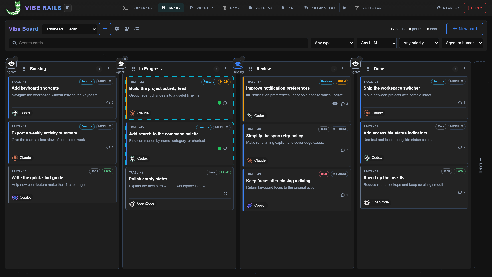
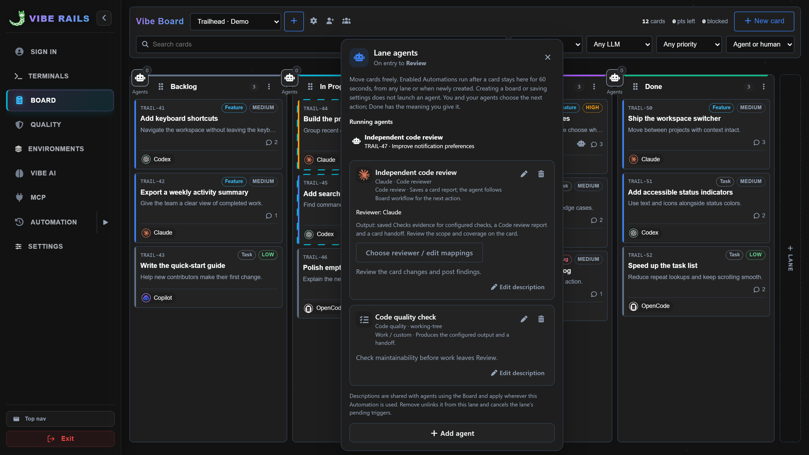
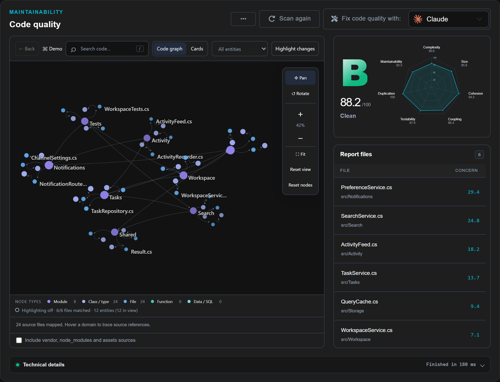
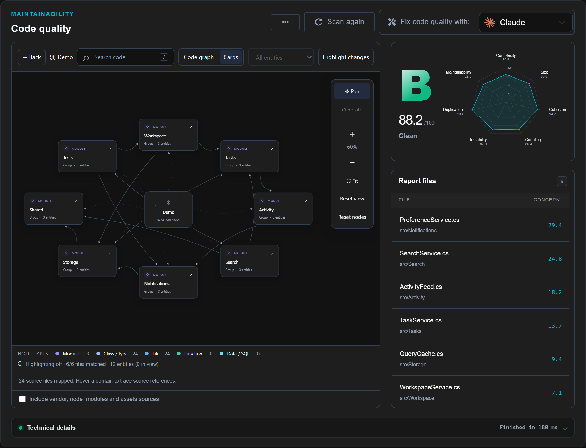
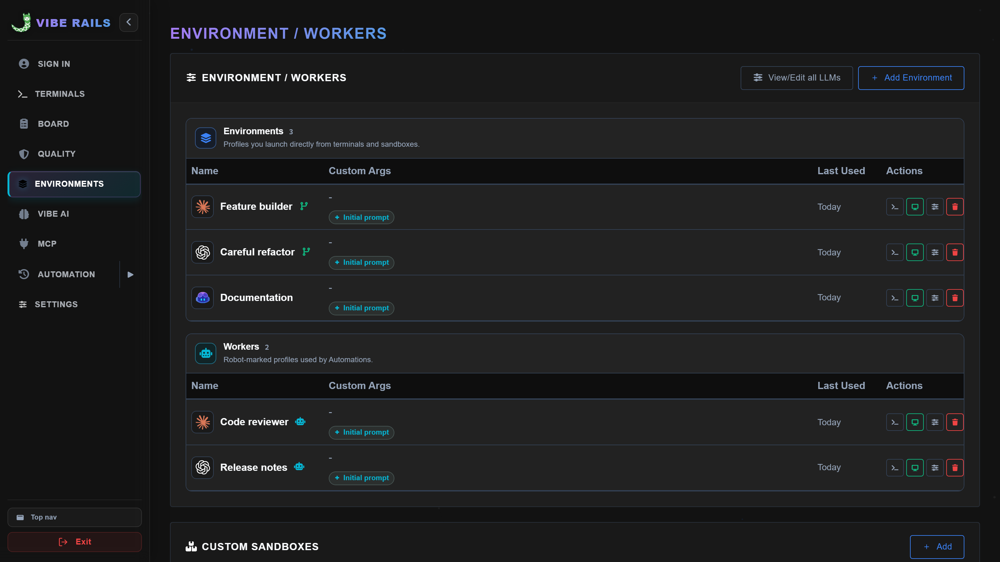
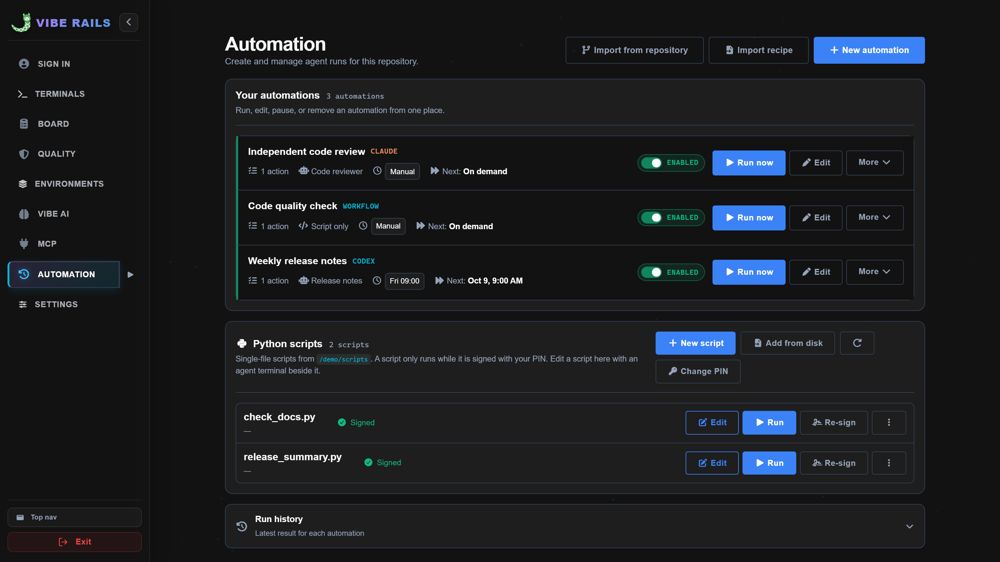
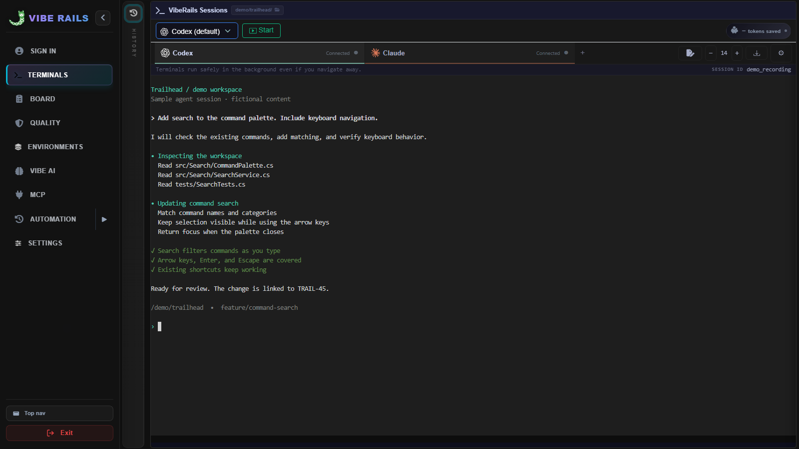

# VibeRails in action

VibeRails brings AI coding terminals, project rules, code quality, and a shared work Board into one workspace. Use it in a browser or inside VS Code.

These screenshots use a fictional **Trailhead** project. Cards, agent activity, quality scores, and terminal output are illustrative demo data.

## Plan work across agents

Assign cards to coding agents, move work through lanes, and see which sessions are active.

## Run reviews and checks from a lane

Configure the Automations that run when work enters a lane. The lane panel shows configured checks and running agents.

## Explore code quality

See source relationships alongside a health summary and file-level concerns. Switch between the code graph and connected cards, then open a file's saved measurements.

## Reuse coding environments

Keep prompts and workspace choices in named environments. Automation Workers provide reusable configurations for reviews and other repeatable tasks.

## Automate repeatable work

Combine repository scripts and an optional Worker into workflows. Run them manually, from a Board lane, on a schedule, or around commits. Automations run while VibeRails is open.

## Keep the terminal close

Work with CLI sessions in VibeRails' terminal interface. This capture uses a hand-authored sample transcript.

[Browse all 15 screenshots](vscode-viberails/media/screenshots/README.md) · [Install the VS Code extension](https://marketplace.visualstudio.com/items?itemName=viberails.vscode-viberails) · [Project README](README.md)
