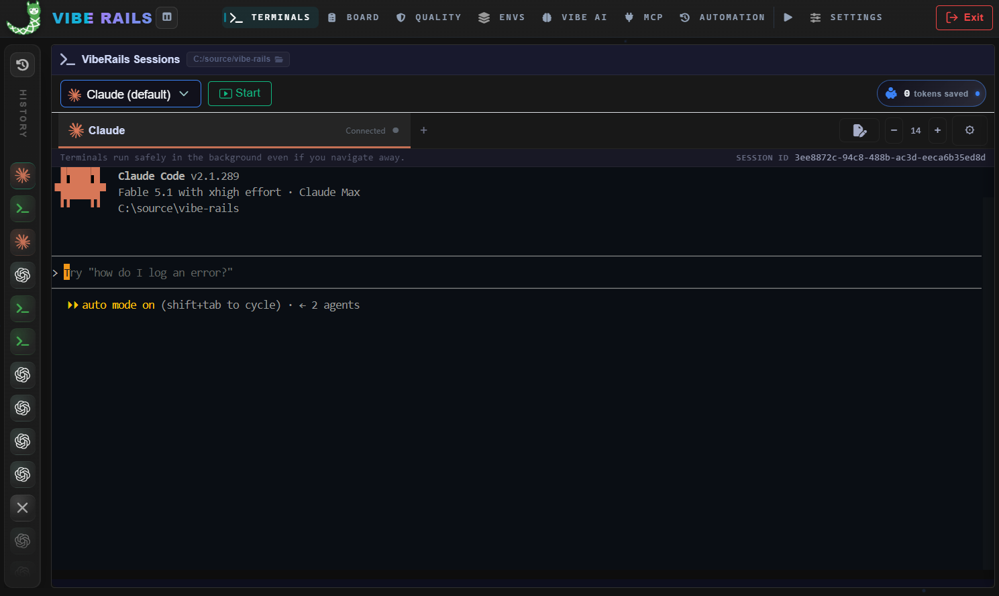
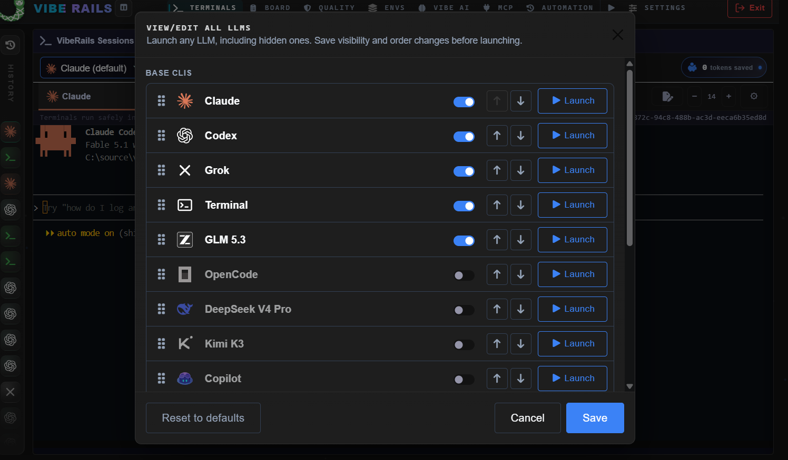
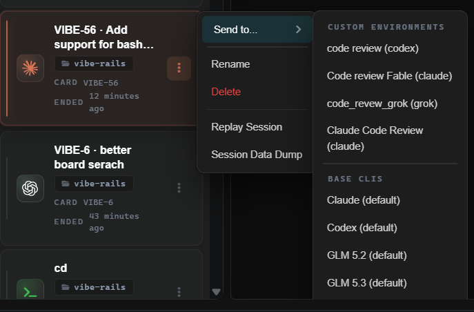
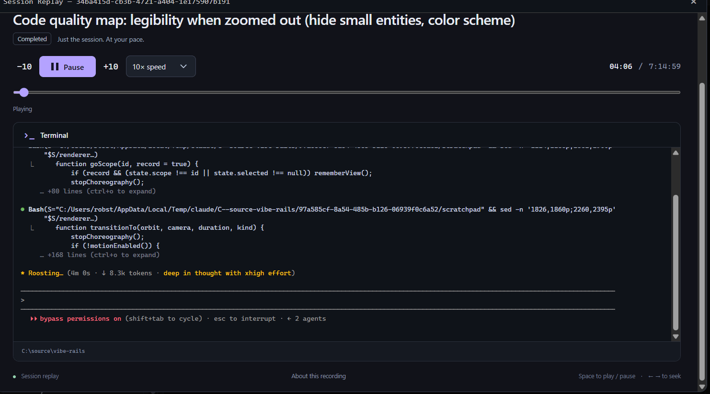
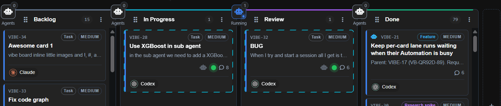
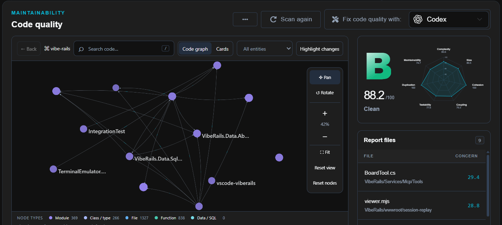
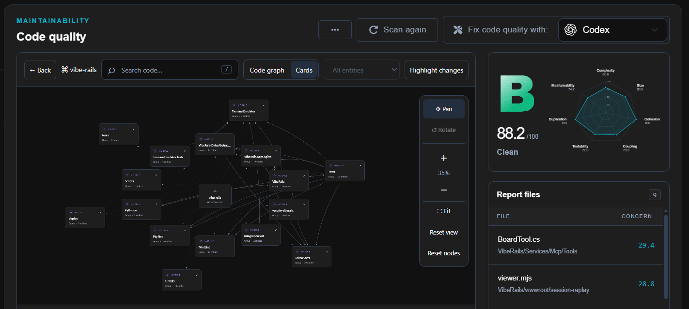
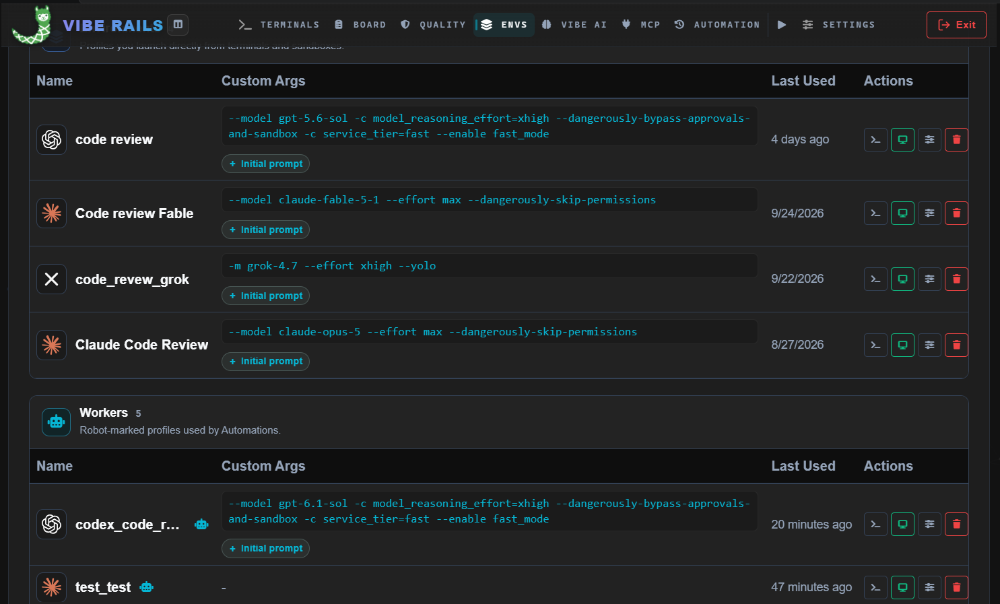
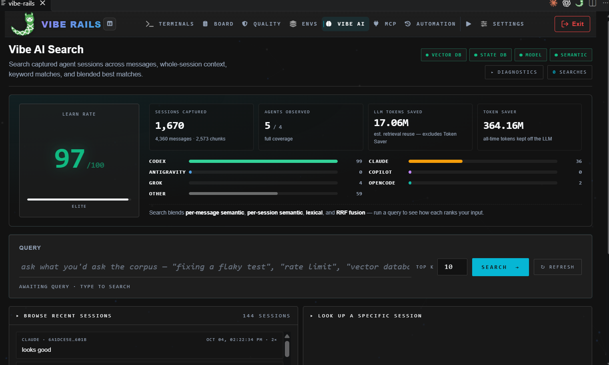
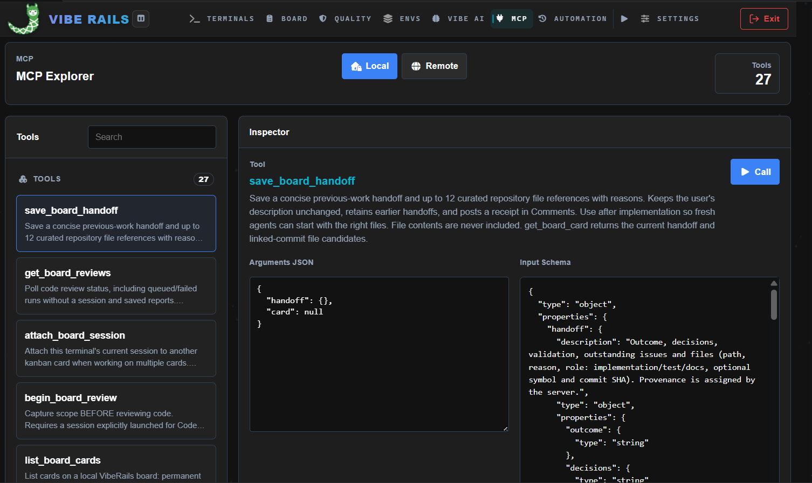

<div align="center">
  
  <h1>VibeRails</h1>
  <p><strong>An opinionated framework that keeps AI coding assistants from going off the rails.</strong></p>
  <p>
    <a href="https://marketplace.visualstudio.com/items?itemName=viberails.vscode-viberails"></a>
    <a href="https://dotnet.microsoft.com/"></a>
    <a href="https://www.typescriptlang.org/"></a>
    <a href="LICENSE"></a>
    <a href="https://viberails.ai/"></a>
  </p>
</div>

VibeRails is a local control panel for AI coding CLIs. Run Claude Code, Codex, Grok, OpenCode,
GitHub Copilot and Antigravity side by side, plan their work on a Board, enforce your rules on
every commit, and search everything your agents have done. Use it inside VS Code or in a browser.



*Every screenshot here is VibeRails being used to build VibeRails.*

[Terminals](#terminals) · [History and replay](#history-and-replay) · [Board](#board) ·
[Quality](#quality) · [Envs](#envs) · [Vibe AI](#vibe-ai) · [MCP](#mcp) ·
[Automation](#automation) · [TokenSaver](#tokensaver) · [Install](#install) ·
[Build from source](#build-from-source)

---

## Terminals

Launch any supported CLI in a real PTY-backed terminal tab: Claude Code, Codex, Grok, OpenCode,
GitHub Copilot, Antigravity (`agy`), GLM 5.2, GLM 5.3, DeepSeek V4 Pro and Kimi K3 (the last four
run through OpenCode), or a plain shell. Sessions keep running when you switch pages, and tabs
reconnect when you come back.

**View/Edit all LLMs** decides which CLIs and saved environments the launcher shows, and in what
order. It can also launch any of them, hidden ones included.



## History and replay

Every session lands in the History rail. Its menu replays the session, renames or deletes it,
downloads the raw session data, or uses **Send to…** to hand it to another CLI or saved
environment: VibeRails summarizes the session and starts the new agent with that summary, so the
work carries on in a different model.



Replays play the recorded terminal back at 1× to 100× speed, with a scrubber and arrow-key
seeking. Board cards and Automation runs open the same player.



## Board

A kanban board for each project, where every card is a work item for an agent. Assign a card to a
CLI or environment and **Start work** launches it with the card as its brief. Agents keep the card
current through the built-in MCP tools: comments, handoffs, linked commits and sessions. Search
ranks cards semantically across every local board, and cards can link to work in other projects.

The robot button on each lane header attaches Automations that run when a card enters that lane,
such as a code review, a rules check or a quality scan. Cards with a live agent get a moving
border.



## Quality

Rules, Git Guard and code quality share one page.

- **Rules** live in `vc.rules.md` files in your repository. A `WARN` rule is reported, a `COMMIT`
  rule blocks the commit until its message acknowledges the rule, and a `STOP` rule blocks it
  outright. Agents can run the same check with the `validate_vca` MCP tool.
- **Git Guard** turns on the git hooks that enforce those rules on every commit.
- **Code quality** grades the repository with MintLint: a letter grade, a score out of 100, a
  radar across complexity, size, cohesion, coupling, testability, duplication and
  maintainability, and the files that need the most attention.

Explore the repository as a live code graph or as connected module cards, highlight what changed,
and hand the report to an agent with **Fix code quality with…**.





## Envs

Save a CLI with its model, arguments and initial prompt as a named environment, like Conda for
LLMs, and launch it from any picker. An environment can work in the project folder, in its own git
clone or in a fresh clone each run, and can run setup commands before the CLI starts.

**Workers** are environments marked for Automations, so reviews and other unattended work always
run with the same setup.



## Vibe AI

VibeRails captures the sessions from every CLI and indexes them locally. Vibe AI Search finds past
work by meaning or by keyword, blending per-message and whole-session semantic matches with
lexical ones. Agents search the same history through the `search_history` MCP tool, so a fix one
CLI worked out is there for the next.

The page also shows how many sessions and agents have been captured and how many tokens
TokenSaver has kept off the LLM.



## MCP

VibeRails hosts an MCP server inside the app and registers it, as `viberails-mcp`, with each agent
it launches. Its tools cover Board cards, comments, handoffs and reviews, session history search,
rule checks and TokenSaver control.

The **MCP Explorer** lists every tool with its description and input schema, and calls it with the
arguments you give. **Remote** mode inspects an external MCP server inside an isolated sandbox.



## Automation

An Automation is an ordered workflow of repository scripts (`.py`, `.ps1`, `.sh`) and at most one
Worker. Run it on demand, on a schedule, before or after a commit, or when a Board card enters a
lane. The signed scripts library keeps reusable pwsh, bash and Python scripts that run only after
you sign them. Automations run only while VibeRails is open; there is no background service.

> [!WARNING]
> Automations are not sandboxed. They run unattended with the same operating-system permissions
> as VibeRails. A Worker set to use its own clone or a fresh clone works in a throwaway checkout,
> but that is not a security boundary: an agent can still reach files outside it through CLI
> arguments, configuration, MCP servers, tools or scripts. Review every Worker and script, and use
> a disposable account or machine for untrusted prompts, tools or repositories.

## TokenSaver

Claude Code, Codex, OpenCode and Grok can route through TokenSaver, a proxy built into VibeRails
that trims noisy tool output, such as build logs, passing tests and repeated lines, before it
reaches the model. It never rewrites your prompts or the model's replies. Lossy trims leave a
marker so the model can re-run a narrower command, and if anything goes wrong the original request
is sent unchanged. Switch it on or off for each CLI in Settings; the **tokens saved** meter in the
terminal bar keeps the running total.

---

## Install

**VS Code (recommended):** install
[VibeRails from the Marketplace](https://marketplace.visualstudio.com/items?itemName=viberails.vscode-viberails).
The backend ships inside the extension, so there is nothing else to install and nothing is
downloaded at runtime. Open it from the **VibeRails** status-bar button, the
`VibeRails: Open Dashboard` command, or `Ctrl+Alt+V` (`Cmd+Alt+V` on macOS).

**Standalone:** installers for Windows, Linux and macOS are on [viberails.ai](https://viberails.ai/).

You also need at least one coding CLI installed and signed in.

To connect a viberails.ai account, open **Settings → General → Account** and choose **Sign in**.
While an account is connected, VibeRails uploads completed sessions to it.

## Build from source

Prerequisites: the [.NET 10 SDK](https://dotnet.microsoft.com/download),
[Node.js 24 LTS](https://nodejs.org/) or later (local builds and release automation read
`.nvmrc`), Git, and VS Code 1.125 or later for the extension.

```bash
git clone --recurse-submodules https://github.com/robstokes857/vibe-rails.git
cd vibe-rails/VibeRails
dotnet run
```

The dashboard opens in your default browser. In an existing clone, run
`git submodule update --init --recursive` once to fetch the submodules.

To work on the VS Code extension, follow the [extension guide](vscode-viberails/AGENTS.md#development).
Test commands for every layer are in [AGENTS.md](AGENTS.md#build-and-test).

## Documentation

| Topic | Where |
| --- | --- |
| Contributor policy and where to start by area | [AGENTS.md](AGENTS.md) |
| Architecture reference | [docs/architecture.md](docs/architecture.md) |
| API security contract | [API_SEC.md](API_SEC.md) |
| Git Guard hook installation | [docs/git-hooks.md](docs/git-hooks.md) |
| TokenSaver internals | [TokenSaver/README.md](TokenSaver/README.md) |
| Internal tools and feature logs | [docs/internal-tools.md](docs/internal-tools.md) |
| VS Code extension | [vscode-viberails/README.md](vscode-viberails/README.md) |

## Status

This repo is a lightweight, local-focused version of my personal setup. I'm stripping out
multi-GPU/cluster support, heavy eval tooling, and other framework dependencies so it runs fast
with Claude, Codex, and Antigravity CLIs. I'm rebuilding it around the features I think most
people will actually want for local workflows.

## License

[MIT](LICENSE)

---

**Maintained by** Robert Stokes · **Last updated** 2026-10-04

*Last checked: 2026-10-04 by Claude Code (claude-opus-5-5)*
