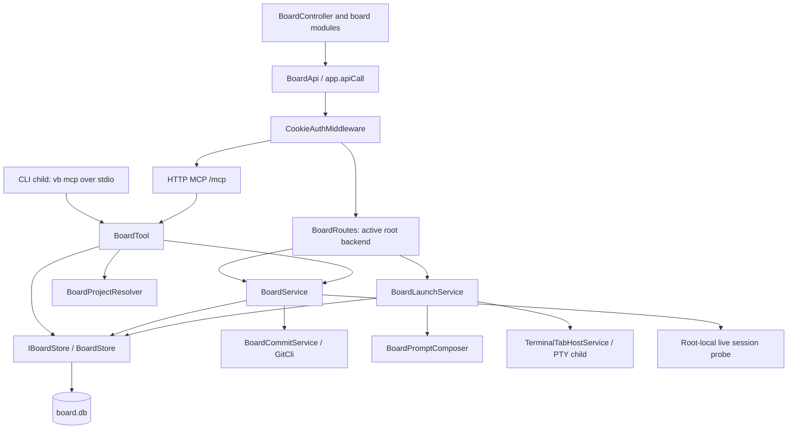

# Vibe Board architecture and review

## Card editor and local refresh (VIBE-44)

Previous work preserves the card-recall handoff and file entry points in a collapsed sidebar
section. Code quality/VCA summaries are also in the sidebar; the main column contains Description,
uploads and Comments. Description is editable source without preview controls. Rendered comments
always use Markdown. Discussion filters can hide routine agent entries or show agents only;
attention comments remain visible at the top, followed by chronological discussion.

`BoardController.refreshBoardSnapshot` polls the visible board every ten seconds and on return to
the window. It reloads lane/card summaries and the already loaded depth of completed lanes using
fresh ordering tokens. A changed ordering token during paging discards the partial snapshot.
Navigation, foreground refresh, paging and dragging invalidate or cancel background reads. The
existing single editor and its drafts stay mounted; activity refresh updates sessions, Comments
and their attachment/commit metadata together. It rejects a response if local discussion or rail
data changed during the request, and defers editor updates during uploads/saves. Pending uploads
and composer drafts remain on the editor.
No schema, handoff persistence or review workflow changes are involved.

## Card recall (VB-13)

`save_board_handoff` stores outcome, decisions, validation, outstanding issues and up to twelve
curated file references independently of the task description. Paths are repository-relative;
each has a reason, implementation/test/docs role, optional symbol and commit. The server stamps
author/session/time. `board-recall/1` adds append-only handoffs and a derived embedding cache;
startup does not convert old card data. Saving also appends the full handoff to Comments in the
same transaction, so prior handoffs remain readable and ordinary discussion sync carries their
text. Structured handoffs and vectors are currently local; they are not part of hosted projection.
Merge copies handoffs while retaining source rows. Linked commit snapshots supply bounded,
explicitly uncurated path candidates without loading file contents. Current reads mark missing
paths, links and historical references; they do not claim a commit-era file is current.

`get_board_card` returns Previous work beside the description. Descriptions use 12,000-character
pages with `descriptionOffset`; the existing activity budget and `before` cursors remain.
`read_board_session` checks card/session membership, lists ten captured message previews, and
pages individual documents in 12,000-character chunks. A missing index is reported as unavailable.
No Board tool types into a live terminal.

`BoardRecallService` resolves explicit short/display keys within the current project and full
permanent keys across local projects before broad history ranking. It recognizes `card 10` only with a linked launching-card
context. Short-key prefixes must belong to this project's permanent, legacy or current/historical
display IDs, so incidental tokens such as `GPT-5` and `UTF-8` do not suppress discovery. Full
permanent keys remain explicit. Recognized keys produce explicit misses when absent; multiple keys
never substitute a different card. No-key queries use `BoardSearchService`, shared with dashboard
search, related-card candidates and the explicit `search_board_cards` MCP tool. It searches all
local boards, preferring the current repository and labeling foreign projects. Current titles,
descriptions, Comments, legacy notes and handoffs participate in keyword and BGE reciprocal rank
fusion, weighted by lexical evidence and semantic similarity. Current-project matches receive a
bounded 10% boost; a strong foreign match can outrank weak local matches. Exact immutable identities
win, while ambiguous short/display aliases prefer their current-project meaning.
Project-only consumers (merge and session/commit reference pickers) constrain eligibility before
ranking and the 50-result limit, using `currentProjectOnly=true` on the draft candidate route.
The filter uses the server's project, and unbound searches retain already-linked destinations.
Change history, deleted cards and hidden/deleted discussion do not participate. VIBE-55 moves
retrieval to the shared `search.db`: full sources and FTS, token-aware BGE chunks, sqlite-vec,
result metadata and durable work all live there. The existing root jobs reconcile bounded
source pages and claim resumable work fairly across cards, inputs and sessions. Queries never
populate embeddings or enrich results from state.db. Legacy Board JSON caches remain stored
but unused. Content/model versions and fenced completions reject stale vectors; changed sources
lose old searchable chunks before replacement inference. See the
[shared search contract](../BertV2/README.md). Source access remains behind `IBoardStore`.

The existing **Chat with agent** control accepts an optional 1,000-character question. Discussion
launches carry a short MCP bootstrap, at most 2,000 characters of environment initial message and
4,000 characters of environment arguments. Existing command preparation checks the final escaped
Windows launch command, including provider options and Board grants. Discussion and implementation
may coexist; `chat` links do not populate the working-agent indicator or block Start work. An empty
question searches all live discussions for the selected agent before checking capacity; a question
or an agent without a matching discussion starts fresh. Focus does
not record another launch sample. The picker defaults to the latest discussion selection, then
the assignee. Lane and assignment stay unchanged.

Commit recall uses the existing VB-14 Git fix: argv execution, closed stdin, fsmonitor disabled,
bounded pipe draining and explicit timeout diagnostics. Capture must succeed before linking.
Regression fixtures cover handoff isolation, duplicate keys across projects, token boundaries,
missing files, description/session paging, and discussion/work coexistence.

## Local MCP discovery (VIBE-28)

`BoardTool.ListBoards` uses `IBoardStore.GetLocalBoardsAsync` to show current-project boards first,
followed by a separate other-project section with stored project paths, board IDs, lanes and counts.
Only the current project retains first-use board setup; listing other projects does not seed them.
Board IDs and globally unambiguous names select explicit destinations for list/create operations.
`FindLocalCardAsync` resolves full random stored keys or row IDs across projects; short keys and display
labels still resolve within the current project. Foreign card lists include row IDs, including for
legacy cards whose computed or imported short keys are not globally unique. Reads include the owning project.

MCP derives the selected project from stored metadata, then calls the existing scoped services.
Ordinary REST remains bound to the dashboard project. VIBE-6 adds explicit authenticated
`/api/v1/board/local-cards/{identity}` reads/edits/comments/links using server-resolved ownership.
Foreign results open a separate editor with repository and board warnings. Related-card links
can cross local projects using permanent keys/row IDs; foreign links are omitted from hosted
activity publication. Moves/attachments still validate both endpoints;
cross-project card transfer and cross-project session attachment are not introduced. Cross-project
writes do not auto-link sessions or change omitted-target defaults. Commit capture still uses the
caller's actual checkout. VIBE-28 added no migration, listener, tool name or provider grant;
VIBE-6 adds the derived search cache and explicit search tool/grant described above, without a new listener.

## New-board review defaults (VIBE-23)

There is one supported local lane template: Backlog / Ready / Build / Review / Done. Both first
board initialization and additional-board creation use `InsertBoardWithDefaultLanesAsync`.
The template's Review definition carries recipe `viberails.board.switch-reviewer.v1`; creation
records its newly allocated lane ID in `BoardStarterWorkflows`, in the same Board transaction.
Shared imports and adoption of legacy lanes do not seed local workflows.

`BoardStarterWorkflowService` finishes untouched intents on root Board access and each root
scheduler cycle. Lean stdio creation records the intent for that root recovery without running
full state-schema setup. `IJobStore.EnsureBoardReviewRecipeAsync` creates a dedicated editable
Worker, enabled Job and `BoardAutomationRecipes` receipt in one state.db transaction. The receipt
is keyed by project, lane ID and stable recipe ID, independent of display names. Separate Board
completion assigns once. A failed state write rolls back the Worker too; an interruption between
commits reuses the receipt. The UI reports pending setup while the normal recovery retries.

Both schemas are additive (`board-starter-workflows/1`, `jobs-board-recipes/1`), with no historical
backfill. Lane-settings insert/update triggers only touch the new intent table, cancelling an
unfinished install even when an older writer saves an empty selection. Completed intents and
state receipts survive assignment removal; neither opening nor upgrading refreshes installed
defaults. Lane deletion cancels its intent but keeps its Worker/Automation. Deleted or disabled
Automations encountered during recovery are not recreated or assigned. No transaction spans files.

The workflow is Code quality → VCA (editable unpushed scopes from `ReviewCheckDefaults.Create()`)
→ one explicitly classified Code review Worker. Switch reviewer starts with Claude → Codex,
Codex → Claude and a visible Codex fallback for unknown/mixed/human/unmapped coding sources.
Existing attribution, scope snapshots, prerequisite checks and the root scheduler apply. Missing
providers remain setup problems; no substitute provider or permission bypass is introduced.
When a card has no saved review settings, the receipt's Job and Worker use `unpushed` for the
review snapshot, matching the starter checks and capturing a clean committed handoff. Saved
card scopes take precedence; unrelated Automations retain `working-tree`. This fallback never
writes settings or changes an existing run snapshot.

Every lane, including the first, has a Lane agents button. The panel shows purpose, report/check
output, live reviewer mappings and provider setup guidance. Its shared reviewer editor supports
editable provider/environment targets and a Code review — Codex choice (no source mappings, an
explicit Codex target for every source). It saves the Worker's routing through the existing
Environment update; other Worker fields and Automation actions stay intact. The ordinary
Automation editor owns checks, descriptions, prompts and other workflow edits.

Creation and settings saves never queue runs. Future card entries from any direction, including
creation in that lane, retain the existing 60-second delay. Renaming/reordering never changes the
binding. Saved settings cancel pending entries. Humans and agents choose card movement; output
does not trigger deterministic application moves and Done remains user-defined. Local defaults
do not publish hosted recipes (VIBE-25). Tests: `BoardStarterWorkflowTests`, schema/compatibility
tests, and desktop/mobile Lane agents cases in `board-ux.spec.js`.

## VIBE-26: remote Start work (2026-10-01)

The hosted card editor now offers the owner's Start work action. An open root backend polls
outbound every ten seconds for its own project's published boards. The request is scoped to
the Board owner, API key and selected root instance. The desktop syncs through the requested
sequence, verifies local Board/card identity, and calls the existing BoardLaunchService with
saved launch settings. Imported boards are excluded. See [SYNC.md](SYNC.md#vibe-26-remote-start-work)
for delivery, failure, lifecycle and deployment limits. No local route, listener or schema is added.

## VB-52: shared boards (2026-09-30)

`Sync/BoardSharingService.cs` and six existing-host REST routes expose owner invitations and
accepted-board discovery/import. The website enforces membership; desktop storage remains behind
`IBoardStore`. `BoardStore.Sharing.cs` and additive `board/26` persist pinned origins and apply
layouts transactionally. `board-sharing.js` owns modal requests and disposal. See
[SYNC.md](SYNC.md#vb-52-shared-boards) for privacy, compatibility and POC limitations.

## VIBE-1: card organization and unified discussion (2026-09-30)

`BoardStore.CardActions.cs` adds transactional merge and user-only discussion deletion.
`board/25` adds tombstones and per-event board delivery metadata without changing old rows at
startup. `BoardService.CardActions.cs` and two protected REST routes expose these actions to the
editor; no MCP delete or merge capability is added. `board-card-organize.js` owns the destination
pickers, draft guard, confirmation and teardown. Cross-board moves reuse the normal lane event
queue. A merge appends source content and copies its rails before soft deletion; destination
metadata wins. Legacy notes are read with Comments, and new notes are comments. See SYNC.md for
source/destination delivery, return moves and the companion hosted deletion projection.

## Lane agent controls (2026-09-30)

VIBE-18 adds model/effort labels from the Worker's saved Environment arguments. The panel reads
the Environment catalog when opened, including on a direct Board load; `llm-display.js` formats
known model IDs and effort levels, retaining unknown IDs as escaped text. Its argv tokenizer is
shared with the Environment editor. Unset options have no label.

`IBoardStore.GetRunningAutomationsAsync` reads running Jobs in `state.db` and resolves their
immutable Board trigger to existing project cards in `board.db`, using separate read connections.
Card list/detail/activity responses combine that state with the root's local live tabs, so a debug
window sees a run launched by another root. Run completion/reaping clears the shared indicator;
queued runs do not count. This does not make a foreign terminal focusable or a working agent.
The shell workflow recording and its Worker recording are two sessions of one Automation run.

The activity response also carries `activeAutomationColumnIds` for the requested board, including
when no cards are loaded or filters hide the running card. Only lane-triggered runs light the
originating lane; a later card move does not move that indicator. Moving the card to another board
or deleting its old lane removes the old lane reference. The existing ten-second activity poll
updates a small pulsing dot and Running caption without replacing the lane panel or its drafts.
Reduced motion keeps the dot static. No schema, launch claim, or scheduler changes are involved.

The Board's compact robot buttons overlap adjacent lane header corners without widening the
gutters. Each opens a non-modal panel for the destination lane's existing entry Automations.
`board-lane-agents.js` uses the existing lane GET/PUT and Jobs GET/PUT endpoints: revision-checked
assignment/removal and inline editing of the existing 2,000-character Automation description.
Descriptions start as two-line previews. Edit description opens the field; Save and Cancel close
it, with Cancel discarding the row's draft without writing.
Description saves retain the current enabled state, triggers and workflow; unsaved drafts survive
panel refreshes and failed saves. Board consumers and launch context already read this field.
Create/edit navigates to the existing Automation editor. Every lane now has an agent button,
including the first lane. Badges include paused/unavailable assignments; Lane settings saves also update the badge.
The UI states the 60-second entry delay and the scope of descriptions/removal. Lane entry uses
the existing automatic scheduler, API and persistence. The UI suite exercises desktop/narrow geometry,
assignment/removal, description persistence and draft preservation, editor navigation, conflict recovery and stale-response cleanup.

## VIBE-9: agent completion and Automation lifecycle (2026-09-29)

`complete_board_agent(summary, outcome, card?)` records the current linked session's first final
report. The report is independent of process exit and of a workflow's remaining script actions;
it neither stops a terminal nor moves the card. `get_board_agent_status(card?, sessionId?)` reads
up to ten recent linked agents (or the requested linked session), their report, bounded latest
comment/note and process exit outcome, plus pending lane entries and the newest twenty card
Automation runs. Unknown process liveness stays unknown in stdio; persisted run status still
works across roots. Agent polling reads bounded session context, not the full card activity.
Both tools use the existing BoardTool registrations and exact launch grant allowlist.
Board-triggered Workers now receive that grant and completion guidance, and their own session is
linked even when an outer shell records the workflow. This preserves the original card default
for a Worker in a cloned workspace. Ordinary native launches retain their existing permissions.

The additive `board-agent-completion/1` component creates `BoardAgentCompletions` in `board.db`.
Reports stay behind `IBoardStore`, are scoped by project and linked session, and do not rewrite
terminal history or existing links. They are local coordination state; the final handoff comment
continues to carry the user-facing result into the Board's existing activity sync.

Automations have an optional description (2,000 characters). `jobs-description/1` adds nullable
`Jobs.Description` in `state.db`; an omitted update preserves it and an empty string clears it.
The editor, recipes and repository imports retain it. Lane discovery and move reports include it;
launch prompts include up to five descriptions of 300 characters inside the task-data fence.

The running robot on a card opens its active Automation terminal without opening the editor.
VB-60 supersedes completion-time closure: finished Automation hosts retain a read-only final
screen and up to 20,000 scrollback lines, opened directly from the robot menu. The worker and
recording still finish normally. Hosts remain until dismissed, root shutdown, or capacity
reclamation at 100 tabs. Reclamation still requires a terminal run, inactive PTY, finalized
recording and no concurrent session start. A browser disconnect alone never closes a host.
`automation_terminal_closed` removes explicitly closed, reclaimed or exited hosts and prevents
late browser responses from restoring them. Recordings and Board links remain available from
the card and Automation history. Full-screen history held only inside a CLI is not scrollback.

## VB-69: display IDs and creation links (2026-09-28)

See [the contributor contract](AGENTS.md#display-ids-and-draft-links-vb-69) for mutable labels,
unchanged immutable identity, board/20 compatibility, sync corrections and atomic draft links.
Discussion controls now sit in their own section, with the picker before a text-style action.

## VB-44: manual card Automations and simpler Board controls (2026-09-26)

Review fixes: visible-page activity refresh calls `POST /api/v1/board/cards/activity` with
only loaded card IDs, in batches of at most 100. `IBoardStore.GetCardActivityAsync` reads
scoped card IDs and live session references without descriptions or historical rails. Responses
contain only the card ID, active session/tab IDs and Automation indicator; navigation discards
stale responses and stops further batches. The open editor retains its independent detail refresh.
The card-run query excludes already-linked recordings before applying its 20-run limit, so newer
recordings cannot hide older queued runs or failures before launch.

The card's Automations rail has a project Automation selector and **Run automation** action.
It runs against the saved card, preserving editor drafts. New cards must be saved first.
`BoardCardAutomationService` resolves the card through `IBoardStore`; `JobService` checks
the job/project, enabled state and runtime availability. `JobStore.EnqueueBoardCardRunAsync`
rechecks the project and enabled/overlap conditions while snapshotting the actions.
The existing `JobRuns.TriggerKey` retains `board-card:<actual-card-key>:<unique-event>` with
`TriggerKind.Manual`; no table, column, stored tag, or historical run is rewritten.

`JobBoardContext` recognizes both lane entries and explicit card runs. Both open terminal tabs,
retain Worker Board context and link their recordings through `BoardAutomationSessionLinker`.
Ordinary manual runs and retries keep native-terminal behavior; retries receive a new trigger
key and do not inherit the earlier card. The card's new GET endpoint returns the latest 20
manual card runs that have no linked recording, including queued runs and launch failures.
Once linked, the existing Automations recording rail provides open/replay actions. Catalog/status
refreshes use the editor lifecycle and existing activity refresh; stale responses cannot repaint
another editor, and submitting a run never replaces unsaved text.

Board tiles and toolbar no longer display tags. The editor already omits them on save, and
legacy browser tag filters are ignored. Stored tags, API fields and schema remain intact.
Chat uses a visible accent outline, subtle tint and keyboard focus ring.

## Automation presentation and launch location (2026-09-25)

Board lane runs open recorded terminal tabs regardless of the retired saved launch preference.
Schedule, commit, pre-commit and manual runs (including retries) open native terminals. New run
snapshots retain the derived value for older readers; no schema or historical rows are rewritten.
The Jobs runner detects an existing outer recording by TerminalSessionId to avoid double recording.

Board keeps one session-link store and presents two rails: Sessions, then Automations. Automation
links have an explicit origin; older native/outer/Worker recordings are recognized through their
project-scoped JobRuns session IDs on read. The display name is never used for classification.
A live Automation sets hasActiveAutomation on list/detail responses and blinks the shared robot
icon on the card. The same root-local live-session probe drives the existing border and this icon.
The editor omits Priority, Points, Tags and the YOLO warning text while preserving stored fields
and the explicit YOLO checkbox. No database cleanup or backfill is involved.

## Launch prompt activity and Automation discovery (2026-09-24)

`BoardLaunchService` passes comment, note and earlier-session counts from the detail it already
reads, before linking the new session. `BoardPromptComposer` includes those counts and the linked
commit count inside the card fence. Missing activity context is explicitly `unknown`.
Both launch intents report the card's flag status. A flagged card explicitly requires reading
`get_board_card` and its comments for the agent's unresolved issue and any code review findings,
then checking later comments for decisions or fixes. This applies even with zero activity counts;
the flag is cleared only after its reasons are resolved. Chat still waits for the user's direction.
Other work launches request `get_board_card` before project work only for a truncated description,
unknown activity or a nonzero activity count; fresh cards start with the repository instructions
and inline task. Attachment ids already carried inline can go directly to `read_board_attachment`.
Chat launches still read the full card, summarize status and wait for the user's direction.

Both prompts tell agents to call `list_board_columns` before moving a card to check the
Automations (jobs) that may run on entry. This uses the existing MCP descriptions for any
configured workflow. Commit links and a handoff summary precede the move; its report describes
what queued or skipped. The prompt also reserves attention flags for unresolved owner decisions
or intervention. Tests cover fresh/prior activity, excluding the launching session from the
counts, discussion intent, sanitization and prompt budgets. Installed behavior requires a build
containing these source changes.

## VB-37: explicit YOLO launch option (2026-09-23)

When a card is assigned to a base CLI, its typed launch controls include a warning-styled,
default-off YOLO checkbox alongside model, effort and start mode. The additive `Yolo` member is
stored in the existing `BoardCardOptions` JSON, so older rows deserialize as false and no schema
migration is needed. Start work and same-assignee Chat launches carry the normalized option through
`StartTerminalRequest`; `BaseLlmOptionsBuilder` emits the provider's existing documented flag:
Codex `--dangerously-bypass-approvals-and-sandbox`, Claude/Antigravity
`--dangerously-skip-permissions`, Copilot/Grok `--yolo`, and OpenCode-backed CLIs `--auto`.

Saved environments remain configured by their own arguments and do not accept card-level base
overrides. The YOLO choice is separate from `AuthorizeBoardTools`: the ordinary Board launch still
uses its narrow per-tool allowlist, while checking YOLO explicitly requests the provider-wide
bypass/auto-approve posture for that one process. No provider configuration file is rewritten.

## VB-37: activity-safe card paging (2026-09-23)

Paged lane responses carry an opaque `continuationToken` that fingerprints the complete filtered
card-id order from the same deferred read snapshot as the page. Continuation requests send that
token with their numeric offset. If card activity, a move, create/delete, or a filter-relevant edit
changes membership or ordering, the server marks `restartRequired` and reads from offset zero;
the browser performs a full Board refresh before continuing. The restarted first page is also
returned as a safe fallback for clients that understand the token but not the restart marker.

The fingerprint is computed without loading card descriptions or rails and requires no schema
change. Requests that omit the token retain the legacy offset contract for older clients.

## VB-37: bounded MCP image transfer (2026-09-23)

Uploads store a server signature-derived MIME type. `read_board_attachment` uses that immutable
metadata in a project/card-scoped lookup, without selecting the BLOB or legacy data URL, to reject a
known raster image above 5 MiB before base64 serialization or attachment bytes enter application
memory. Images that pass the preflight are signature-sniffed again after the bounded metadata check;
a defensive content-length check prevents serialization if legacy/corrupt metadata is inconsistent.
The size error includes actual/allowed values and directs the caller to the Board viewer.

This is an MCP response budget, not an attachment quota. Human uploads, SQLite storage and Board-viewer
downloads remain unlimited. Markdown/TXT chunk behavior is unchanged (and still materializes/decodes
the full text file before slicing). No route, tool name, grant, schema or migration changed.

## VB-34: lane Automations visible to agents (2026-09-23)

A lane move never creates a run directly: the store's card triggers record pending lane entries
that the root scheduler drains about 60 seconds later, applying the enabled/deleted/project/
actions/self-overlap gate in `JobStore.InsertRunAsync`. Agents driving the Board over MCP now see
that on both sides of a move, as plain text built from the Automation's own definition (Worker
name and CLI, the first line of its environment prompt, script names), not from a per-kind
template.

Planning surface: `get_board_card`, `list_boards` and the launch prompt annotate lanes as
`Review (on entry: "Automated code review")`; `list_board_columns` adds one `on entry:` line per
Automation with its summary, where its output lands (a Worker terminal run or script output on the
card's Sessions rail) and, when the scheduler would consume the entry without a run, why (disabled,
deleted, another repository, or no actions). An active run makes an eligible entry wait (VIBE-21).
`get_board_card` also lists recent lane entry states and reasons, including before a session
exists. The card-session preamble and the `list_board_columns`
footer carry the sequencing rule: link commits and post the summary before moving into such a
lane, and move once.

Confirmation surface: `move_board_card` keeps its historical first line and appends `Queued:` /
`Waiting:` / `Skipped:` lines per Automation, `Cancelled pending:` for earlier pending entries the move
replaced, otherwise `No lane automations.` or `Same lane; no lane automations triggered.`, plus a
`get_board_card since=<move time>` hint for the run's session. There is no run id at move time,
so settle-time conditions are stated rather than predicted as fact.

`skipAutomations=true` (MCP) / `skipAutomations` (REST `POST /api/v1/board/cards/{card}/move`)
moves the card and deletes the entries the move recorded inside the same store transaction
(`IBoardStore.MoveCardAsync` overload). It is per call, never sticky; the result and a comment by
the caller list what was bypassed. `preview=true` returns the report without moving. The dashboard
does not offer the flag yet; the REST shape is ready for it.

`IBoardStore.DescribeLaneAutomationsAsync` reads `Jobs`/`JobActions`/`JobRuns`/`Environments` in
`state.db` for wording only and degrades to "definition unavailable" when those tables are absent
(a stdio MCP host on a fresh install). The stdio host still registers no `IJobStore`, because
`JobStore`'s constructor runs state migrations. No schema change.

## VB-29: activity ordering and Automation sessions (2026-09-23)

Flagged cards precede unflagged cards in every lane (VIBE-78). Store reads, page selection and
continuation hashes all use flag first, then position/number; rendering preserves that order.
Position writes stably group flagged cards first, including explicit drag moves. Clearing a flag
returns the card to the unflagged group. Older writers are handled by the read projection without
a schema change or backfill.

New cards start at the top of their flag group in their selected lane (Backlog by default). Card field updates,
comments, notes, files, session links, commit links and linked-card changes move the affected card
to the top of their flag group in the same store transaction. Other cards retain their relative ordering and activity
timestamps. Positions stay dense. An explicit drag position is preserved until the next card
update, within its flag group; moves without an explicit position enter at the top of that group.

The active-session action is **Go to agent**. It focuses the existing tab without saving the card
or launching another agent. The same action handles a session discovered during Start work's
save, so another window starting work does not leave a disabled dead end. Only a live session
that is not an Automation's qualifies: list, detail and activity responses skip Automation runs
and the CLIs they spawned when choosing `activeSessionId`/`activeTabId`, and the launch conflict
check ignores them too, so a still-running review cannot keep a card on Go to agent (or refuse
Start work) after the launched agent closed.

`BoardAutomationSessionLinker` links lane-triggered Automation recordings to the originating
card's ordinary Sessions rail. It uses the immutable `board-lane:<card-key>:<lane>:<event>` trigger
and the run's source project, so workspace clones do not redirect the link. The native Worker
callback links its recording; a terminal-tab workflow links its full shell recording and tab.
Native script-only runs now create a normal Shell session before executing. Script stdout/stderr
lines and their elapsed timestamps become batched raw logs and replay frames through
`SessionOutputWriter`; normal, cancelled and timed-out exits complete that session with the
workflow's actual outcome. The run and originating Board card share that recording's session ID.
Repeat callbacks are idempotent and deleted cards are ignored. Card-scoped manual launches use
`board-card:<key>:<event>`. Code review retries retain the card in an immutable
`board-review-retry:<key>:retry:<run>:<event>` trigger, including fixed-provider Workers without
routing snapshots, so prompts, tool grants, links and canonical reports keep their context.
Retries still open native terminals. Work retries retain their ordinary unlinked manual context.
No Board schema changes or historical-session backfill are needed.

Board `GET /cards?pageSize=30` loads all open cards and only the first page of each lane whose
name contains ship/done/complete. `columnId`, `offset`, and the first page's opaque
`continuationToken` load later pages of one lane. If the filtered card order changed, the response
sets `restartRequired` and restarts at offset zero; the browser refreshes before continuing. Search,
assignee, type, priority and tag filters run before LIMIT; full/filtered lane counts, board-wide
statistics and filter choices include unloaded cards. `IBoardStore.GetCardsPageAsync` provides
these through one deferred read snapshot without schema changes. Omitting `pageSize` retains
the original unpaged response for older clients and MCP consumers.

## VB-25: one session working multiple cards (2026-09-21)

An agent calls `attach_board_session(card: "VB-24")` to add its current VibeRails session to
another card in the same project, including across boards. The tool requires an explicit card
and derives session identity from launch context; it cannot select another session. Repeated
calls are idempotent. Reading or commenting on another card does not attach it. The original
card remains the default for omitted arguments; after its link is removed, the oldest remaining
attachment becomes the default. Card lanes and assignees stay independent.

Each card lists the same session and receives its existing live indicator from the owning root's
probe. Opening either Sessions entry opens the same terminal/replay. Rename/unlink applies only
to that card's link, and ending the session clears live status for every attached card. Root-local
status/launch exclusion limitations (F3/F6) remain. Refresh the Board to see MCP attachments.

Call `link_board_commit` once per commit: it automatically links the captured snapshot to the
target card and every card attached to the calling session in the same project, across boards.
Membership and all link/snapshot writes share one transaction; a failure rolls back the whole
operation. Repeated session calls preserve existing links/snapshots and fill missing ones.
Git capture runs once before the transaction. Attaching never copies earlier commits or comments;
calling `link_board_commit` again can share an earlier SHA with a newly attached card. There is
no new unlink/edit tool. The Sessions rail also accepts the same session ID on multiple cards.

Additive `board/10` stores extra links in `BoardAdditionalCardSessions` with a composite
`(SessionId, CardId)` key. The original table, schema generation and data remain unchanged;
older writers can still use the primary table. No backfill or conversion runs. Store reads
combine both tables, prefer the primary row if a legacy writer recreates the same pair, and
scope new links to the same project inside the write transaction. Removing the original link
or card preserves other attachments. Older versions display only primary links.

The Board has 14 MCP tools/grants; REST paths are unchanged. `BoardTool` is registered on both
transports. Only the explicit Board allowlist gains the new tool; listener and auth rules are unchanged.
This amendment supersedes the one-card session restriction in the historical review below.

## Separate Board storage (2026-09-20)

All active Board tables now live in `~/.vibe_rails/board.db`, for every project and every host
(dashboard, stdio MCP, lane Automation scheduler, Debug). `SqliteStorage` owns the path and initialization.
The owner requested a fresh start: legacy Board tables/data and migration receipts in `state.db`
are left untouched and are no longer read or written. There is no import or synchronization.
Old binaries still use their old data; they do not share Board updates with this version.

Board-owned reads/writes, including pending lane events, stay behind `IBoardStore`. This is the
boundary intended for a future shared API-backed implementation; no collaboration API is added
in this change. Terminal history and local Automation definitions remain in `state.db`, with
Board session links, settings, comments, notes, attachments and commit snapshots in `board.db`.

Card moves still enqueue durable lane events within their Board transaction. The existing root
scheduler reads due events via `IBoardStore`, commits Job run/action snapshots in `state.db`, then
acknowledges the exact event in `board.db`. The existing unique TriggerKey deduplicates a retry
after a failed acknowledgement, and an old acknowledgement cannot remove a later lane entry.
No writer lock spans both files. Moves/settings edits racing an already-read event can still
produce a run; this best-effort behavior is accepted. This supersedes the shared-database and
cross-component transaction descriptions in the historical review and amendments below.
Only scheduler compositions opt in to Board event consumption. Commit hooks and non-scheduling
Automation hosts use `state.db` without resolving or initializing Board storage.

## VB-18 simplification and attention flag (2026-09-20)

The owner requested one current card state and no WIP limits. This amendment supersedes
the history/WIP contracts and recommendations in the historical review below.

- Removed the WIP editor, thresholds, warnings, wire fields and stored limit. Lane headers retain counts.
- Removed description revision history, manifests, session read/edit/launch events, the REST
  `GET /api/v1/board/cards/{card}/history` route and `get_board_card_history` MCP tool/grant.
  Current description replacements accept the last write; append reads current text within
  the write transaction and validates the combined length. There is no revision retry logic.
- Attachment deletion removes its row and bytes; no historical attachment download remains.
  Comments, notes, sessions, linked commits and their code snapshots remain.
- Added `Flagged`: **Needs your attention** in the editor, red tile with a flag icon, and
  `update_board_card(flagged: true|false)`. It is independent of blocked. Launch prompts tell
  agents to flag a card and comment when human review is needed.
- Breaking `board/8` retires history/WIP and removed files, advancing state generation to 3.
  Existing installs upgrade automatically with a backup and SQLite transaction coordination. Additive
  `board/9` adds the attention flag. Board context and lane Automation revision checks remain.

The Board now has **37 REST routes and 13 MCP tools**. F1's last-write behavior is an explicit
owner choice; F2's revision recovery path is gone. F4's WIP portion is removed, but its filtered
ordering issue remains. F3 remains open and was deprioritized in discussion; F5/F6/F7/F8 are
outside this change. The following VB-22 and VB-16 automation/context behavior is preserved.

Upgrade policy correction (2026-09-20): the initially shipped manual `vb --migrate` gate caused
Board initialization to fail on existing installs. All migrations now run automatically during
normal initialization. Breaking steps back up the existing database under the writer lock;
concurrent initializations wait and recheck the ledger. Users never need a migration command,
opt-in setting, or manual shutdown of other VibeRails windows to use a new version.


## VB-22 implementation amendment (2026-09-20)

Lane settings now select multiple existing project Automations. `jobIds` carries the full,
distinct list; an empty list disables lane Automations. The existing route and expected revision
are unchanged. Legacy `jobId` requests still replace the selection with zero or one job; responses
retain `jobId` for the first selection alongside `jobIds`. Sending both fields is rejected.
Every selected job must be enabled, undeleted and in the lane's project at save time.

Additive `board/7` leaves board/6 SQL and data intact. The first selection and pending event stay
in their original tables; `BoardLaneAdditionalAutomations` and `BoardPendingAdditionalAutomations`
hold the remainder. New card insert/move triggers fill the additional queue in the card-write
transaction. Header updates clear additional selections and cascade their pending events, so a
legacy settings save also replaces the full list. New saves validate the full list before writing,
advance the shared revision, and rebuild additional selections atomically. No backfill is needed.

Each Automation queues independently after the same 60-second settling period, with its own
enabled/deleted/project/overlap checks. There is no execution-order dependency. The scheduler
consumes each queue in a transaction with the resulting run/action snapshots; an old scheduler
can consume the original queue without discarding additional events. Extra jobs wait until a
backend supporting board/7 runs. Moving away, settings saves and card/board deletion cancel all
applicable pending events. Same-lane edits/reorders and already-queued runs keep existing behavior.

## VB-16 implementation amendment (2026-09-19)

Board settings now include a default agent message and per-type `default`, `replace`, or
`append` modes (default only, type only, or default then type). Each message is capped at
4,000 characters. `BoardContextSettings` persists per board with a revision-checked save;
the authenticated `GET|PUT /api/v1/board/boards/{boardId}/context` routes derive project scope
from the backend. Launch selects context from the card's current board/type. Context is literal:
template braces and control/bidi characters are neutralized. Only the existing environment
Initial Message remains a template. Oversized combined launch prompts fail before starting a tab.

`POST /api/v1/board/cards/{card}/launch` accepts `intent: "work" | "chat"` (omitted = work).
Both paths preserve the shared workspace, assignee/options, Board-only grants, session link and
exact description-revision provenance. Work stays on the Board. **Chat with agent** saves the
form then adopts/focuses the returned terminal, with instructions to read current card activity
and history, summarize status, and wait for discussion. Opening chat does not move the card or
authorize implementation merely by opening a terminal. Existing root-local launch exclusion (F3)
still applies to both intents.

Lane settings now select one existing enabled Automation from the current project through
`GET|PUT /api/v1/board/columns/{columnId}/automation`. Saves require the settings revision.
Creating a card in a configured lane or moving it to a different lane records one pending
trigger for that card, due **60 seconds** after the latest entry. Another move replaces/cancels
it, including cross-board moves, MCP moves, form saves and lane-deletion relocation. Same-lane
reordering and metadata edits do not restart the timer or trigger a run. Saving lane Automation
settings cancels pending entries for that lane and affects future entries only.

Additive `board/6` creates `BoardContextSettings`, `BoardLaneAutomations`,
`BoardPendingAutomations`, a due-time index and two card triggers. Triggers write only to the new
tables and preserve old card SQL compatibility. The existing leased Automation scheduler drains
settled entries on its normal cycle (normally within 10 seconds after the 60-second delay).
The run/action snapshot commits in state.db before the exact entry is acknowledged in board.db;
the immutable trigger key deduplicates retries across roots and restart. It rechecks the exact
entry, current lane, configured job, project, enabled/deleted state and ordinary overlap guard.
Unavailable events receive terminal reasons; busy events stay pending (VIBE-21). Once committed,
the normal Automation run lifecycle applies; a later move does not cancel the committed run.
Pending entries survive backend shutdown and are processed when a root backend is open again.
There is no additional scheduler host, daemon, OS registration, listener, or MCP grant.

The original review below remains historical. Its open findings have not been resolved by VB-16.

Reviewed for **VB-18, description revision 1**, on **2026-09-18**, against commit
`1f4fd71` (`Add linked-card relationships to board cards`). This is the component reference
and the review of that implementation. Findings below remain open; this documentation change
does not implement their fixes. Session checkpoints and investigation history are on VB-18.

## Assessment

The Board has a useful separation between presentation, application policy, and persistence.
REST and MCP share the same services and SQLite transactions. Description history, attachment
manifests, and saved commit snapshots provide considerably more durability than a simple lane UI.
Keep this architecture and strengthen its concurrency and lifecycle contracts before adding
automatic launches or more writers.

The main correctness risks are **silent loss of concurrent edits** and **launch ownership that
exists only in one root backend's memory**. Seven issues were reproduced with isolated probes;
an additional draft-loss issue follows directly from the modal close path. Existing tests pass
but do not cover these cases. No authentication bypass, executable attachment preview, SQL
injection, or shell injection was confirmed in the Board paths reviewed. That is a scoped result,
not a certification of the entire application or of every provider's native approval behavior.

## Component map


```mermaid
flowchart TD
    UI[BoardController and board modules] --> API[BoardApi / app.apiCall]
    API --> Auth[CookieAuthMiddleware]
    Auth --> Routes[BoardRoutes: active root backend]
    Auth --> HTTP[HTTP MCP /mcp]
    CLI[CLI child: vb mcp over stdio] --> Tool[BoardTool]
    HTTP --> Tool
    Routes --> Service[BoardService]
    Tool --> Service
    Tool --> Resolver[BoardProjectResolver]
    Tool --> Store[IBoardStore / BoardStore]
    Service --> Store
    Service --> Git[BoardCommitService / GitCli]
    Routes --> Launch[BoardLaunchService]
    Launch --> Store
    Launch --> Prompt[BoardPromptComposer]
    Launch --> Tabs[TerminalTabHostService / PTY child]
    Service --> Live[Root-local live session probe]
    Store --> DB[(board.db)]
```

| Responsibility | Source of truth |
| --- | --- |
| View lifecycle, lanes, filters, editor, launch UX | [board-controller.js](../../wwwroot/js/modules/board-controller.js), `board-template` in [index.html](../../wwwroot/index.html), Board styles in [style.css](../../wwwroot/style.css) |
| Authenticated frontend calls | [board-api.js](../../wwwroot/js/modules/board-api.js), shared `app.apiCall` |
| Inert text/files; related-card picker; provider options | [board-text.js](../../wwwroot/js/modules/board-text.js), [board-attachments.js](../../wwwroot/js/modules/board-attachments.js), [board-card-links.js](../../wwwroot/js/modules/board-card-links.js), [board-launch-options.js](../../wwwroot/js/modules/board-launch-options.js) |
| HTTP adapter / request and response shapes | [BoardRoutes.cs](../../Routes/BoardRoutes.cs), Board section of [ResponseRecords.cs](../../DTOs/ResponseRecords.cs) |
| Validation, application operations, mapping | [BoardService.cs](BoardService.cs), its `.Attachments.cs` and `.Links.cs` partials |
| Storage contracts and records | [VibeRails.Data.Abstractions/Board](../../../VibeRails.Data.Abstractions/Board) |
| SQL, migrations, ordering, history | [VibeRails.Data.Sqlite/Board](../../../VibeRails.Data.Sqlite/Board); implementation is **not** in this services directory |
| Agent workflow adapter | [BoardTool.cs](../Mcp/Tools/BoardTool.cs), [MCP contributor reference](../Mcp/AGENTS.md) |
| Project and checkout identity | [BoardProjectResolver.cs](BoardProjectResolver.cs), [BoardSelection.cs](BoardSelection.cs) |
| Starting work and prompt composition | [BoardLaunchService.cs](BoardLaunchService.cs), [BoardPromptComposer.cs](BoardPromptComposer.cs) |
| Narrow provider grants | [BoardMcpAuthorization.cs](../Terminal/Commands/BoardMcpAuthorization.cs), [BoardMcpOpenCodeAuthorization.cs](../Terminal/Commands/BoardMcpOpenCodeAuthorization.cs) |
| Service lifetimes and transport parity | [MapRegisterServices.cs](../../MapRegisterServices.cs), [McpStdioHost.cs](../Mcp/McpStdioHost.cs), [SqliteStorage.cs](../../../VibeRails.Data.Sqlite/SqliteStorage.cs) |

`BoardStore`, project resolver, commit service and live probe are singleton services;
`BoardService`, `BoardTool`, and the root-only launch service are scoped. Store operations own
their connections. The abstractions and SQLite projects retain the historical
`VibeRails.Services.Board` namespace: follow physical project ownership when adding code.

## Identity, ownership, and state

A project has one or more boards. A board has ordered lanes; a card belongs to a board through
its lane. Card numbers are unique **per project**, including across its boards. `VB-18` is a
display key, not a globally unique identifier; generated `card_*` IDs identify rows globally.
Board, lane, attachment, comment and note IDs use type prefixes and 12 hexadecimal characters.

The key's prefix belongs to the project (VB-32, 2026-09-22). `BoardProjectKeys` (`board/11`)
stores one prefix per project, assigned inside the transaction that numbers the project's first
card: the initials of the project folder's name (split on `-`, `_`, `.`, spaces and camelCase),
else the name's first letters, else four random letters, always two to four upper-case letters
and never one another project in `board.db` already displays. Projects that numbered cards
before `board/11` are seeded with `VB`; a project whose first card an older binary numbers also
gets `VB`, because that binary shows every card as `VB-n`. A prefix never changes, so no key that
was read, committed or linked is rewritten. Since VB-51 (`board/14`) a new card stores its key
at creation in `BoardCards.CardKey` — `{PREFIX}-{5 crypto-random [A-Z0-9]}-{Number}`, upper-case,
never rewritten, unique in `board.db` — so a key stays unique once boards are synced to
viberails.ai. A card with a NULL `CardKey` (created by an older binary) keeps its computed key
(`COALESCE(BoardProjectKeys.Prefix, 'VB')` and the number). Lookups try the stored key
case-insensitively, then the project's own prefix or the legacy `VB` alias for the same number,
then the id, and treat another project's prefix as not found rather than resolving it by number.

The default board is `Main`. New boards start with Backlog, Ready, Build, Review, Done; users
can rename, remove or reorder lanes. The four lanes on VB-18's own board are configuration,
not a hard-coded state machine. WIP limits are advisory UI feedback, not database or API gates.
The UI's done statistic infers completion from lane names; there is no persisted completion flag.

The server normalizes project paths with full-path resolution and trailing-separator removal.
Queries use case-insensitive comparison on Windows/macOS and case-sensitive comparison on Linux.
This is path identity, not repository-remote identity or symlink canonicalization. Moving a
checkout changes its board lookup identity unless an existing linked session resolves it back.

REST uses the dashboard root from `ParserConfigs`; it accepts no caller-selected project path.
MCP resolves root configuration, then the launching session's card, then cwd's Git root, then cwd.
This lets a sandbox agent address its source project's board. Commit capture separately resolves
the actual checkout (`GitWorkingDirectory`), so a sandbox commit can be linked to the source card.
The environment session ID is local process context, not a cryptographic identity credential.

An assignee is `base:<cli>` or `env:<id>:<cli>`, not a person. Saved environments are resolved by
ID and checked against provider and project visibility at launch. Base provider options are
typed model/effort/start-mode/YOLO records; YOLO defaults off and becomes a provider-native launch
flag without changing configuration. Changing assignee clears incompatible options. Board-launched
terminals are real PTY CLI sessions, not a separate chat service.

## Main flows

### Load, edit, move

`loadView` fetches the board catalog, then the chosen board's lanes and cards. Generation checks
discard obsolete responses after refresh, board switch, or unload. Local storage remembers
selection and filters; authoritative cards remain server-side. There is no Board subscription,
polling loop, or change feed. MCP writes become visible on refresh or reopening a card.

The editor fetches full detail and uses the shared modal with a single scroll region and right
rail. Comments, agent notes, linked cards, commits, sessions, and attachments are separate data.
Links mutate immediately without saving the form. New-card uploads queue until the card exists.
Save and Start work submit the form's fields, including `expectedDescriptionRevision`.
Description conflict protection is narrower than whole-card concurrency protection (F1/F2).

Moving posts a destination lane and a zero-based position. The store resolves source and
destination inside one write transaction, reinserts into the full ordered destination list, and
renumbers affected lanes densely. Deleting a lane appends its cards to the left-most remaining
lane **on that board**. Deleting the last lane or last board is rejected. Deleting a board deletes
its cards, lanes, and dependent records; it does not stop the linked CLI processes.

### Start work

1. UI saves current fields and rechecks the returned active-session state.
2. Launch service resolves card/assignee, takes an in-process reservation keyed by card ID,
   rereads the card, and checks that root's live tabs and tab capacity.
3. Composer builds the prompt from the selected description revision, lanes, up to ten linked
   commits and twenty attachment names, followed by the environment's initial-message template.
4. Tab host creates a child and starts the CLI with `AuthorizeBoardTools: true`, typed options,
   source project directory and composed prompt. Normal workspace resolution still applies.
5. The returned session is linked to the card, then the exact launch revision is recorded.
   Failure to record that history is logged without killing an already linked agent. Earlier
   startup failures attempt to delete the new tab.
6. UI remembers `board-card:<cardId>` and stays on the Board; Sessions opens the terminal.

The reservation is released when startup finishes. Durable session links and live tab state are
different concepts. There is no cross-process launch lease (F3). Another startup race worth a
targeted integration test: the child can start before its source-card link is committed, so an
early MCP call from a clone could initially resolve the clone's project. This race was not
reproduced in this review and is not counted among confirmed findings.

### Agent work and history

MCP reads record the exact returned description revision without linking the reader to the card.
Writes try to auto-link a VibeRails session only when it has no card link. A session has at most
one card link; writing a second card does not transfer ownership. Comments and notes retain
author/session attribution. Notes use the same table with a different `Kind` and do not inflate
comment counts. `get_board_card` shows a roughly 3,000-character note tail; `get_board_notes`
returns the full notes. `since` filters returned activity after it has been loaded.

Description creation/change and attachment membership changes create immutable revisions in the
same transaction as the mutation. Each revision owns an attachment manifest. `read`, `launch`,
and `updated` session events refer to revisions; `updated` is not an acknowledgment that the
agent consumed the text. Saving does not inject input into a running agent. MCP full reads use
the shared service and separately look up linked session outcomes. Unknown liveness is currently
misreported in their text output (F6).

### Attachments and commit snapshots

Uploads are JSON containing a base64 data URL. Service derives byte count and MIME category;
client-declared values are not authoritative. Names are display labels, never filesystem paths.
Original bytes live in SQLite; small safe raster previews also have a data URL. Removal sets
`DeletedUTC` and creates a revision. Historical manifests can still retrieve the original bytes
through the same project/card-scoped endpoint. This is removal from the current card, not erasure.

Commit linking validates a 7–40 hex SHA, captures Git metadata and changed-file before/after blobs,
then atomically inserts the commit link and JSON snapshot. Git runs with discrete argv values,
not a shell-built command. Limits: 60 files, 400,000 characters per side/file with a truncation
marker, and a bounded changed-file listing. Root commits, renames, merges and gitlinks have
explicit handling. Viewing uses the saved snapshot and survives deletion of the checkout.
Legacy links lacking snapshots return a recapture instruction. Linking an existing SHA returns
a conflict without duplicating the snapshot; short prefixes must identify exactly one linked
commit for diff/unlink.

## REST and MCP contracts

All **35 Board HTTP mappings** are under `/api/v1/board`, behind both session and tab credentials,
and registered only for `ProcessRole.IsActiveRootBackend`. Relative paths below share that prefix.

| Resource | Methods and paths |
| --- | --- |
| Boards | `GET/POST /boards`; `PUT/DELETE /boards/{boardId}` |
| Lanes | `GET/POST /columns`; `PUT /columns/order`; `PUT/DELETE /columns/{columnId}` |
| Cards | `GET/POST /cards`; `GET/PUT/DELETE /cards/{card}`; `GET /cards/{card}/history`; `POST /cards/{card}/move`; `POST /cards/{card}/launch` |
| Related cards | `GET /cards/{card}/links/candidates?q=`; `POST /cards/{card}/links`; `DELETE /cards/{card}/links/{linkedCard}` |
| Repository files | `GET /files?q=` — names for the composer's `@path` typeahead (VB-35); root path only, never contents |
| Comments / notes | `POST /cards/{card}/comments`; `GET/POST /cards/{card}/notes` |
| Files | `POST /cards/{card}/attachments`; `GET /cards/{card}/attachments/{attachmentId}/content`; `DELETE /cards/{card}/attachments/{attachmentId}` |
| Commits | `GET/POST /cards/{card}/commits`; `DELETE /cards/{card}/commits/{sha}`; `GET /cards/{card}/commits/{sha}/diff` |
| Sessions | `GET/POST /cards/{card}/sessions`; `PUT/DELETE /cards/{card}/sessions/{sessionId}` |

Lane/card lists take `?boardId=<id>`; omission means the first board by position. Full card lookup
accepts an ID or project-local key across boards. Candidate links search the entire project and
cap results at 50. Summary responses omit the rails but **include the full description**.
Lists use wrappers (`boards`, `columns`, `cards`, `notes`); single mutations return DTOs or an OK
body. Validation returns 400, conflicts 409, missing resources 404; unexpected storage failures
can propagate as 500. `RunAsync` also maps all `InvalidOperationException`s to 400, which can hide
programming errors as client mistakes.

REST updates are partial despite using PUT. Omitted/null ordinary fields leave existing values;
an empty assignee clears it. Points distinguish omitted (`JsonElement.Undefined`) from null/empty
(clear). Description replacement and append are mutually exclusive. Append without an explicit
expected revision retries once against the winning text. A supplied revision is checked only
when a description is supplied. Options have an explicit clear flag.

| MCP tools (14, both HTTP and stdio) | Capability |
| --- | --- |
| `list_boards`, `list_board_columns`, `list_board_cards` | Discovery/filtering; board ID or unambiguous name |
| `get_board_card`, `get_board_card_history`, `get_board_notes`, `read_board_attachment` | Detail, revision provenance, scratchpad, paged UTF-8 TXT/Markdown reads |
| `create_board_card`, `update_board_card`, `move_board_card` | Create/patch/move; omitted card defaults to launching session where supported. Move reports queued/skipped lane Automations and takes `skipAutomations` / `preview` (VB-34) |
| `add_board_comment`, `append_board_note`, `add_board_attachment`, `link_board_commit` | Append attributed work, bounded text attachment, durable Git capture |

MCP update exposes a subset of the REST fields and has no expected-description-revision
argument. Description replacement through that tool is unconditional; prefer append when
adding context, and add a revision argument when implementing concurrent replacement safety.
MCP cannot currently clear points or change assignee/base options through its update signature.

There are no Board MCP delete, launch, board-management, or related-card mutation tools. MCP
returns human-readable text and `FAIL: ...` strings, not REST status codes or structured error
results. Cancellation propagates; busy database errors tell the caller to retry. Read-style
calls are not universally side-effect-free: initial listing can seed a board and full card reads
can append a revision-read event. Native grants enumerate these exact tool names and do not
authorize unrelated tools on the same server.

## Database model and transaction boundaries

Board data lives in the user's global `board.db`; terminal history and local Automations remain
in `state.db`. Neither database is stored in the checkout. `BoardStore` owns component migrations
and can initialize from stdio without constructing the main `Repository`.

| Table | Identity / relation / purpose |
| --- | --- |
| `Boards` | PK `Id`; project, name and display order |
| `BoardColumns` | PK `Id`; project and nullable `BoardId`; lane/order/WIP/color |
| `BoardCards` | PK `Id`; FK `ColumnId`; `UNIQUE(ProjectPath, Number)`; fields and position |
| `BoardCardSequences` | PK project path; persistent high-water number, independent of deleted cards |
| `BoardCardOptions` | PK/FK card; source-generated JSON for typed launch options |
| `BoardComments` | PK `Id`; FK card; body, author, session; `Kind=comment|note` |
| `BoardCardSessions` | PK session ID; FK card; tab/selection/provider/origin/display metadata |
| `BoardAttachments` | PK `Id`; FK card; metadata, optional preview, soft-deletion timestamp |
| `BoardAttachmentContents` | PK/FK attachment; original byte BLOB |
| `BoardDescriptionRevisions` | PK `(CardId, Revision)`; immutable description and attribution |
| `BoardDescriptionRevisionAttachments` | PK `(CardId, Revision, AttachmentId)`; immutable membership |
| `BoardDescriptionSessionEvents` | PK `(CardId, Revision, SessionId, Kind)`; provenance, no live notification |
| `BoardCommits` | PK `(CardId, Sha)`; Git metadata/link time |
| `BoardCommitSnapshots` | PK/FK `(CardId, Sha)`; durable JSON before/after content |
| `BoardCardLinks` | Ordered pair PK plus `CHECK(CardId < LinkedCardId)`; symmetric relationship, two cascading FKs |

Card-dependent rows cascade on card deletion. There is deliberately no FK to terminal `Sessions`:
manual links and retained Board provenance can outlive terminal history. `BoardColumns.BoardId`
has **no FK** and remains nullable for compatibility; Board deletion explicitly deletes cards
and lanes. Project agreement across board/lane/card and across linked cards is enforced by scoped
store transactions, not composite foreign keys. Dense positions, allowed taxonomy, field lengths,
last-board/lane protection and WIP policy are also not generic SQL constraints.

Most mutations use `BeginTransaction(IsolationLevel.Serializable)` (an immediate writer
transaction in this provider). Pair linking explicitly uses `deferred: false`. Allocation of
card number + insert, moves + renumbering, description + revision, attachment + manifest, and
commit + snapshot are atomic. Git capture occurs before its write transaction. Detail/catalog/
history reads perform multiple SELECTs without a shared snapshot, so their composite responses
can reflect adjacent moments during concurrent edits.

Connections enforce foreign keys, a five-second busy timeout, private cache for file databases,
and `synchronous=NORMAL`. The shared migration runner establishes WAL. NORMAL durability means
an OS crash/power loss can lose recent commits even though application-crash recovery is supported;
this shared policy affects Board work as well as terminal logs. There is one writer per database.

Migrations: `board/1` core tables plus attachment/history schemas; `/2` comment kind; `/3` card
type; `/4` multiple boards and lane `BoardId`; `/5` card links. Startup also read-probes and repairs
missing/low number sequences, missing description baselines and lanes with null board IDs.
It must not rewind high-water numbers. Follow the [migration policy](../../../VibeRails.Data.Sqlite/DB/AGENTS.md)
and schema snapshot tests; altering already-applied migration SQL does not upgrade existing files.

## Security review and explicit tradeoffs

| Boundary | Observed protection / limitation |
| --- | --- |
| Browser to backend | Production auth middleware precedes endpoints and static serving. Session cookie or session header plus `viberails_tab` are required on Board and HTTP MCP. Root-only registration is separate from authentication. |
| Project scope | No REST/MCP project-path argument. Ordinary REST uses the dashboard project; explicit MCP targets and VIBE-6 local-card editor routes resolve ownership from stored metadata. Related-card links can cross local projects with immutable identities; moves remain within the selected project. This is local application scoping, not multi-user tenancy. |
| SQL and Git | Values are SQL parameters. Variable SQL fragments are internal constants. SHA validation, argv-based Git and blob IDs avoid shell/path interpolation for snapshot capture. |
| Browser content | Escape-first small text renderer; attachment images allow only raster data URLs. File response is an octet-stream attachment with `nosniff`, `no-store`, and restrictive CSP. Text uses `textContent`; PDF paints to canvas, not an active document iframe. |
| Agent instructions | Launch composer bounds text, neutralizes template braces, flattens controls/bidi in metadata, and labels card content as data. Tool output is still untrusted text; fences are guidance, not an authorization boundary. |
| MCP permissions | HTTP uses both credentials. Stdio is a process owned by the local user and has their database access; no new listener. `AuthorizeBoardTools` is explicit/default-false and produces a per-launch 14-tool allowlist, with provider-specific handling. It is a client approval choice, not a server-side card ACL. A separate default-off YOLO option can explicitly request the base provider's global bypass/auto-approve flag. |
| Destruction / retention | MCP has no delete tool, but allowed tools can alter other cards in the resolved project. Card deletes are soft (`DeletedUTC`, VB-51) and the Card Log records each field change with its old value, but nothing restores from it automatically. Do not claim all agent writes are reversible. |
| Availability | Authenticated file uploads intentionally have no byte limit, and attachment routes disable Kestrel's request limit. Base64 JSON, decoded bytes and SQLite BLOB handling buffer whole files. Current-file count is 40, but removed history bytes, comments, revisions and snapshots have no aggregate retention budget. |

The unlimited-file behavior is explicit existing product policy, not an accidental missing check
or newly discovered auth violation. Large uploads can exhaust browser/backend memory before
disk capacity is reached; removing current files does not reclaim historical bytes. Preserve
arbitrary file-size support by considering streaming, bounded concurrency, lazy reads and
explicit retention/export controls rather than silently reintroducing the old byte quota.

Two repository-wide listener searches found only the approved main Kestrel implementation,
the non-serving `PortFinder` probe and test hosts; the cross-runtime search had no matches.
Board route enumeration matched the 34-route Board inventory in [API_SEC.md](../../../API_SEC.md).
No API security-contract violation was established, so no `SECURITY_ERROR.md` was created.
This was not a new inventory reconciliation of every unrelated application endpoint.

## Prioritized findings

P1 = silent loss of user/agent work; P2 = observable workflow correctness; P3 = lower-impact
contract drift. Source references below name the methods as well as their baseline line numbers.

### F1 — P1: full form saves overwrite concurrent metadata

**Evidence:** `board-controller.js:1825` (`readCardForm`), `BoardService.cs:266`
(`UpdateCardOnceAsync`), `BoardStore.cs:447` (`UpdateCardAsync`). The UI submits title, lane,
assignee, type, priority, points, tags and blocked along with description; only the description
revision is checked, and metadata changes do not increment it.

**Trigger/result:** open revision 1 in the browser; an agent changes title/priority or moves the
card without changing description; save the old form. The save succeeds and restores stale
fields. A real service/store probe reproduced title/priority loss with the expected revision
still set to 1. Lane moves and assignment are exposed to the same full-payload behavior.

**Recommendation/test:** add whole-card optimistic concurrency and a UI conflict/reload/merge
path, or submit only changed fields with per-field conflict semantics. Test two clients editing
different fields, conflicting fields, and moving a card while its editor is open. Preserve the
separate immutable description revision for agent provenance.

### F2 — P1: upload retry can bypass description conflict detection

**Evidence:** `board-controller.js:1343` (`restampDescriptionRevision`) and `:1887` (save failure
recovery). After a card save succeeds but a queued upload fails, recovery fetches the current
revision and adopts it without comparing the returned description with the editor's base text.
`syncAttachmentRevision` elsewhere already performs such a comparison.

**Trigger/result:** save description A, upload one file, let another writer save description B,
then fail the next upload. Recovery adopts B's revision while the editor retains A; retry Save
can overwrite B with a matching token. The real restamp handler probe confirmed the mismatched
text/token pair. Existing partial-upload coverage only tests attachment-only revision changes.

**Recommendation/test:** restamp only if the fetched normalized description matches the last
successfully saved description; otherwise keep the conflict and the remaining upload queue.
Add an interleaved description edit to the partial-upload regression test.

### F3 — P2: duplicate-start prevention does not span root backends

**Evidence:** `BoardLaunchService.cs:33,93` uses a static in-flight dictionary and the injected
tab host's list; `BoardCardSessions` is unique by session ID, not by active card claim. Multiple
root backends may coexist (`Routes.cs:55`).

**Trigger/result:** root A starts work on a card; root B opens the same project and starts it
again. B cannot see A's live tabs. An isolated probe with two independent mocked tab hosts and
one real store successfully created two linked sessions for the same card. This models the
scope mismatch; it did not launch two real CLIs. Unlinking a running session also removes the
association used by the same-root guard without stopping that process.

**Recommendation/test:** introduce a database-backed launch claim/lease with owner and recovery
semantics, held through startup and live ownership. Reserve before starting the child and do
not make display-link removal release execution ownership. Test independent processes, crashed
owners, cancellation and unlinking. This can use existing root processes; no daemon/listener is
needed. If multiple agents per card are desired, make that an explicit policy instead.

### F4 — P2: dragging with filters sends the wrong position

**Evidence:** `board-controller.js:643` (`onCardDropped`) counts rendered `.board-card` elements;
`BoardStore.cs:557` (`MoveCardAsync`) interprets that number against every card in the lane.

**Trigger/result:** full lane `[hidden A, visible B]`; drop C after B while a filter hides A.
The UI posts position 1, producing `[A, C, B]`. The handler probe reproduced the payload and
resulting ordering. WIP feedback in this handler similarly counts visible rather than all cards.

**Recommendation/test:** use visible neighbor IDs translated against the full authoritative
order, or disable ordering while filtered with an explanation. Test same-lane and cross-lane
drops with hidden cards before, between and after visible neighbors, plus full-lane WIP counts.

### F5 — P2: duplicate lane names make MCP moves ambiguous

**Evidence:** `BoardService.cs:143,178` allows duplicate lane names; `FindColumnAsync` returns
the first case-insensitive name match. Board-name lookup already rejects ambiguous matches.

**Trigger/result:** create two lanes named Build on one board; ask MCP to move a card to Build.
It silently chooses the first lane, with no way for the caller's name to identify the second.
A real store/service probe confirmed this behavior.

**Recommendation/test:** mirror board-name resolution: exact scoped ID first, then exactly one
name match, otherwise return an ambiguity error listing IDs. Test duplicate/case-equivalent names,
different boards, and cross-board moves by lane ID.

### F6 — P2: MCP says “ended” when session status is unknown

**Evidence:** `McpStdioHost.cs:144` registers `NullBoardLiveSessionProbe`;
`BoardTool.cs:710` (`FormatCard` session branch) falls back to `ended` even without `EndedUtc`.
The outcome record itself documents null as unknown.

**Trigger/result:** read a card from stdio while its linked session has no recorded end, or link
a manual session without an outcome row. The tool says “ended.” A real tool/store probe verified
the latter; the former follows from the same null-probe path. Agents may infer work has stopped
when it has not.

**Recommendation/test:** represent live/ended/unknown separately. Only report ended with evidence;
do not treat a missing local tab as global inactivity. Cover missing, ongoing, ended and pruned
session rows under both transport probe types.

### F7 — P3: frontend still caps attachments at 12

**Evidence:** `board-controller.js:848,1299` renders “Up to 12” and rejects the thirteenth file;
`BoardAttachmentData.cs:6` and transactional count enforcement allow 40 current attachments.

**Trigger/result:** add file 13 through the editor. It fails before upload even though API/MCP
can add it. The actual upload-handler probe reproduced this. Removing current files frees slots;
history-retained files are intentionally excluded from the server's count.

**Recommendation/test:** align the UI limit/help with the server contract, preferably via shared
capability metadata. Test 12→13, 39→40, 40→41, pending uploads, and removed historical attachments.

### F8 — P2: ordinary modal close discards drafts without a guard

**Evidence:** `board-controller.js:989,1120` supplies cleanup on close and guards only linked-card
navigation. `app.js:1235,1240` binds the ordinary close button directly to `closeModal`, which
clears the DOM without a veto or draft persistence.

**Trigger/result:** edit a title/description or compose a comment, then click the modal X and
reopen. Unsaved content is lost. This is a source-confirmed control-flow finding, not an
additional browser reproduction in this review. Pending new-card attachments are also draft
state; already-uploaded files and immediate link operations have separately persisted.

**Recommendation/test:** use one discard/draft policy for close, replacement and navigation,
including in-flight save/upload completion. Test X, Escape, linked navigation and page unload;
ensure intentional Save and Delete close without a redundant prompt.

## Maintainability and scaling follow-ups

- **Large controller/store:** the controller is about 2,200 lines and the main store about
  1,670. Extract editor state/save coordination and lane-order operations along behavior seams;
  retain the shared modal and services. Avoid another UI framework or a second board backend.
- **Heavy reads:** card summaries carry up to 100,000 description characters each; card detail
  loads every comment/note; history returns every full revision; MCP `since` and note-tail
  truncation happen after materialization. Add lightweight previews, cursors and lazy rails;
  benchmark realistic long-lived cards before adding continuous refresh. Per-session outcome
  lookups also perform repeated schema checks and separate connections.
- **Atomic writes, composite reads:** use deferred read snapshots where a coherent response is
  required, not immediate writer transactions. Keep response revisions tied to their actual text.
  There are also post-commit rereads: a committed mutation can appear failed if rereading then
  encounters a lock/cancellation. Define retry/idempotency behavior before adding automated retry.
- **Schema guardrails:** nullable/unconstrained board ownership and application-only taxonomy are
  compatibility choices. Add integrity diagnostics/tests before tightening constraints through
  the migration policy. Do not rewrite applied migrations or silently rebuild user data.
- **Contract drift:** UI counts, duplicated path normalization, lane-name ambiguity, broad
  exception mapping, text-only MCP errors, and old prose demonstrate missing shared contracts.
  Prefer targeted cross-layer behavior tests over source-string assertions for these boundaries.
- **Freshness and capacity:** no live Board feed, no history pagination, no aggregate retention
  policy and memory-buffered uploads are current limits. Their remedies should be explicit feature
  work with measured budgets. No load test or large-file stress test was performed here.

Suggested order: F1/F2 first; F3 before expanding launch automation; F4/F5/F6/F8 as focused UX
and MCP fixes; F7 as a small contract alignment. Then address read size/retention and extract
controller responsibilities using the new regression coverage.

## Validation and remaining coverage

Run from the repository root unless noted. All production code was unchanged for this review.

Backend command:

```powershell
dotnet test Tests/Tests.csproj --no-restore --filter "FullyQualifiedName~Board|FullyQualifiedName~CookieAuthMiddlewareTests|FullyQualifiedName~McpServerHttpTests|FullyQualifiedName~McpStdioHostTests" -p:OutputPath=bin/VB18Review/ --verbosity quiet
```

| Check | Result and scope |
| --- | --- |
| Focused backend command above | **239 passed**; real temp SQLite, Board routes, services, Git capture, tools, grants, auth and MCP wiring |
| `node --test Tests/wwwroot/js/board-*.test.mjs` | **63 passed**; real modules with unit doubles plus source-shape assertions |
| `npx playwright test --config playwright.board.config.js` from `UITests` | **20 passed**; real browser/frontend, mocked APIs, desktop/narrow layouts, inert text/PDF/file previews |
| Isolated review probes | Real JS handler probes for F2/F4/F7; real store/service/tool probes for F1/F5/F6; independent mocked root tab hosts for F3. Synthetic database only; no real CLI launch. Reproduction procedures and intended regression tests are above. |
| Source security pass | 34 Board mappings; shared middleware/order, both MCP registrations, grant allowlist, SQL/Git inputs, attachment rendering/download, prompt composition and both listener searches |

The test commands isolate output from running application binaries. Existing analyzer warnings
were observed (`xUnit1051`, `xUnit2029`). A full solution suite, Native AOT publish, live provider
approval checks, true multi-process launch reproduction, and load/resource-exhaustion tests were
not run. Passing current tests does not close the eight findings.

**Installed-runtime observation:** after committing this review, the live `link_board_commit`
tool rejected both short and full SHA as “not found” after about ten seconds, while local Git
resolved the commit immediately. VB-14 already records the same installed-stdio failure and a
source fix pending deployment/live verification. The reviewed `GitCli` disables fsmonitor and
closes stdin, and `BoardCommitService` distinguishes timeout from a missing commit. This session
did not establish why the installed host still fails or replace that host. The actual commit
SHA and unsuccessful link attempts are recorded on VB-18; a successful snapshot link is still
pending. Do not confuse testing current source with testing the installed MCP binary.


## Explicit code reviews (VIBE-20)

Workers and ordinary Environments have an explicit optional `Purpose` (`work`, `code_review`, `testing`, `building`, `deploying`, `documentation`, or `other`). The
Environment editor offers Work / custom, Code review, and an editable Codex Code review preset.
Switch reviewer uses the same purpose and report contract (see VIBE-22 below).
Creating a preset does not enable lane triggers. Existing Automations still run
after the normal lane-entry settling period, and humans/LLMs continue to decide card movement.

`environment-purpose/1` and `job-run-purpose/1` add default-Work columns to `state.db`. Jobs copy
the purpose and existing provider/Worker identity when queuing; retries preserve that snapshot.
Names never classify a run. No old session is retagged. Both normal state setup and lean Jobs
setup adopt the Environment column when the table exists, so startup order does not matter.

`board-reviews/1` adds `BoardReviews` in `board.db`, behind `IBoardStore`. A direct card review
creates an attempt before opening its terminal and records startup failures without requiring a
session. Automation attempts are projected from immutable Job runs, including queued and failed
runs without recordings. Their canonical report uses the Job run ID; direct attempts use their
own ID. `BoardReviewService` joins process observations with those records. Saved reports are
immutable and remain independent of process success, completion reports, lane names and movement.
One comment refers to each saved report; discussions and handoffs stay in Comments. Reports are
local Board evidence; hosted report publication remains outside this change.

`begin_board_review` captures the calling terminal's actual checkout before review. Supported
scopes are working-tree, unpushed, a pinned full-SHA range, repository, or explicit unknown scope.
Range/unpushed reviews may include dirty changes. Captured file names, base/head and fingerprints
are retained. Capture is repeated to detect concurrent changes; unavailable/binary contents or
failed capture leave freshness unknown. Unknown scope forces an Incomplete report.
`save_board_review` requires the same linked session and saves findings, validation and limitations
with No findings reported, Findings or Incomplete. A successful exit without it is Report missing.

`get_board_reviews` and the root-only `/cards/{card}/reviews` reads expose the same record. History
pages direct attempts and review Automation runs by 50; the latest saved report is fetched
independently, so many newer unfinished attempts cannot hide it. Freshness comparison only reads
the caller's server-derived checkout, never a stored path. A different checkout is Unknown;
changed HEAD or captured inputs are Stale. Opening a report in the UI compares inputs; the user
can compare again after editing files. Findings are escaped text with file references.

The card's Code reviews section uses the saved card, preserving editor drafts. Its Switch reviewer
defaults and override picker send explicit `code_review` intent and leave assignment unchanged. Recordings
have terminal/replay access and are excluded from ordinary Sessions/Automations counts. The
review snapshot also classifies an early MCP-created link without rewriting its stored origin.
The existing visible-page activity refresh updates the section; requests/pickers are disposed on
editor replacement. Both launch prompts teach ten-second MCP polling and handling findings by severity.
High (including critical) and medium-high findings block completion of reviewed work. Medium-low
and low findings are non-blocking notes; the worker chooses to fix now or create/reuse a backlog
card. Deferral references the original card and finding in the backlog card and links its key in
an original-card comment, with the choice saved in the handoff. These notes alone do not require
another review. Reviewer guidance prioritizes concrete impact and keeps style preferences,
speculative concerns and optional refactors non-blocking. This is shared launch guidance for direct
and Automation reviews and their workers; saved reports and user-edited recipes are not rewritten.
Reviewer prompts require saving the review and handoff before a move, discovering destination
Automations, and reporting the move. Done alone never grants merge/publish permission.

## Switch reviewer (VIBE-22)

`ReviewRoutingService` resolves the reviewer for existing Code review Workers/Jobs and direct card
reviews. `ReviewerRouting.SwitchDefault()` maps Claude to Codex and Codex to Claude, with Codex as
the visible fallback. All mappings and the fallback are editable, including same-provider targets,
other supported providers, custom environments and base model options. A direct review can override
the selection once. Fixed-provider Workers retain their existing pipeline. New-board template
seeding consumes this default in VIBE-23; this change does not enable or replace existing Jobs.

Coding attribution is an explicit per-card declaration through `BoardReviewSettings`: unknown,
mixed, human/external, or a linked coding session with a description of its contribution. Assignment,
link order and previous reviewers are never attribution. Known chat/planning/review links and
historical context samples exclude those sessions even when attached to another card. Each card
in a multi-card session needs its own declaration. Unknown or unmapped sources visibly use fallback.

The chosen review checkout is the current project directory. The UI and prompt state this choice
and retain the source session's checkout separately; neither coding clones nor reviewer environment
clone settings silently change it. Queueing pins scope, base/head, input hash, mapping, source,
selected provider/environment/model and the Worker prompt. Unpushed ranges become pinned SHAs.
Retry copies this snapshot and card association. Changes to inputs or reviewer execution settings
require a new review. Missing CLIs can be installed and retried; no alternate provider or permission
bypass is injected. Unavailable input fingerprints force Incomplete on routed reports.

The selected environment owns its arguments, prompt and steps. The Switch Worker adds its saved
initial message; its display CLI settings do not replace the selected reviewer's settings. A Switch
Worker with its own steps or step references records a prerequisite problem explaining how to move
them to reviewer environments. Direct launch uses a server-only workspace-preservation flag that
JSON input cannot set. `begin_board_review` also checks frozen checkout, scope and input hash.

Routing history is included in Code reviews and MCP reports. Source/settings storage stays behind
`IBoardStore`; launch metadata stays in JobRuns. The root-only settings GET/PUT and preview POST use
the existing Board credential gate. Local repository imports copy routing; unavailable project-local
targets require reselection. V2 recipe files round-trip base-provider routing and show its options
for review. Portable custom-environment references await VIBE-25; raw local IDs are rejected.

## Waiting lane Automations (VIBE-21)

VIBE-42 surfaces pending entries on card tiles as **Waiting for Automation**. List, detail and
the bounded activity poll read the same bulk pending-card lookup behind `IBoardStore`; immutable
Job trigger keys suppress the waiting badge as soon as a run commits, even before acknowledgment.
The card stays visible in its chosen lane while its Automation entry waits. Completion does not
move it. In the card's Automations rail, **Continue without this Automation** skips one exact
Job/event pair and records the request in Comments in the same Board transaction. A failed receipt
write rolls back the skip so it can be retried. Stale requests cannot remove a reentry, and
committed runs keep their lifecycle, including the existing independent-commit race.

The lane Agents picker also creates repository Python, PowerShell and Bash script Automations.
Each is a normal single-script Job with explicit argument lines, repository-root working directory
and the existing content-hash approval checks. Saving lane settings never runs the script for cards
already there. A failed lane save retains the newly created Job as the selection for retry.

Lane demand remains in board.db behind IBoardStore when its Automation already has a queued or
running run. InsertRunAsync still enforces one active run per Job for every trigger. Board dispatch
distinguishes a committed duplicate, a busy Job, disabled/deleted/missing Jobs, wrong projects,
missing actions and no-longer-current entries. Only busy/transient failures retry. Manual card
runs return a conflict that explicitly says the request was not queued.

Each scheduler cycle reads at most 100 distinct Jobs, taking the oldest settled entry for each
across both pending tables (due time, card ID, event key). Persisted attempt times rotate Jobs
across batches; one busy Job with hundreds of cards cannot hide other Jobs. The original due
time remains unchanged. The scheduler's normal root lifecycle drives retries, including after
restart; no browser, daemon or alternate runtime database is involved.

Coalescing is per card/Job: departure cancels an uncommitted entry, and reentry creates one fresh
entry bound to the new destination and its 60-second delay. Other cards retain their places.
Same-lane edits/reordering do not create entries. Settings changes cancel pending entries and
affect future entries only. Explicit skip and deletion leave terminal reasons. Once a run commits,
movement does not cancel it; at most one newer pending entry per card/Job can wait behind it.
There is no automatic reentry or card movement on run completion.

Additive migration board-lane-dispatch/1 creates BoardLaneAutomationDispatch and cancellation
triggers on the existing pending tables. It performs no backfill or historical conversion. Older
card/settings writers keep working and the triggers retain their cancellation evidence. An older
scheduler can still consume an overlapping entry under its old policy; upgrade active schedulers
to obtain the waiting guarantee.

The state.db run/action snapshot and board.db dispatch/acknowledgment commit separately. An exact
entry recheck occurs immediately before the run transaction. Movement can still race that recheck
and the independent commit (the existing cross-store best-effort boundary); a committed run wins
over the cancellation observation in all status readers. Trigger keys deduplicate committed runs
after crash, duplicate delivery or acknowledgment failure. A late acknowledgment never deletes
a newer entry. No Board writer transaction spans a state.db writer transaction.

The card Automations endpoint exposes up to 100 lane entries, pending first, with Waiting,
Queued, Running, Succeeded, Failed, Cancelled, Skipped and other native Job terminal states.
Reasons and event/run IDs exist before a recording. get_board_card and get_board_agent_status
show the same states; review/check discovery uses the same pending/terminal reasons while
preserving process outcome versus review result. Actual runs override ledger observations by
immutable trigger key even before acknowledgment. The existing visible editor refresh updates
the display without changing drafts or scheduling work.


## Composer and lane activity (VIBE-34)

`board-references.js` extends the shared composer popup using existing authenticated APIs.
`@` is file-only; `!` searches current-project card titles, keywords and IDs, then lists the
chosen card’s sessions with agent/time/status metadata or inserts a card reference. Only a
complete GUID after `!` reads session history; no recent-history page is fetched (VIBE-59).
`#` retains commit lookup. New card references use ``; saved `@` references
remain readable without conversion. Saved cards link selected
sessions/commits immediately; draft cards queue them until Create. Card text carries reference
syntax; no new schema or historical conversion is involved. `board-markdown.js` styles already
escaped text and never permits raw HTML or arbitrary image sources. `board-composer-preview.js`
provides live styles and small attachment previews for the comment composer. `board-image-previews.js` shares authenticated
raster loading between composer panes and posted Comments, owns Blob URLs and cancellation,
and allows a later render to retry a failed fetch.

The card keeps current check summaries; detailed run/history/reviewer configuration is unmounted.
The lane Agents dropdown can configure VCA or Code quality as an ordinary single-action Automation.
`BoardAutomationService.GetAsync` includes running agents tied to the immutable originating lane,
scoped to its project and board even after a card moves. The open panel polls only
`GET /api/v1/board/columns/{columnId}/automation/running` every 10 seconds: it reads
`IBoardStore.GetRunningAutomationsAsync` (cards matched by stored trigger key, so a legacy short
key cannot fail alias resolution) and the lane's running cards by row ID, without the catalog,
starter recovery or reviewer setup probes. Each root scheduler closes confirmed
completed Automation hosts after their recording flush; saved recordings remain replayable.
