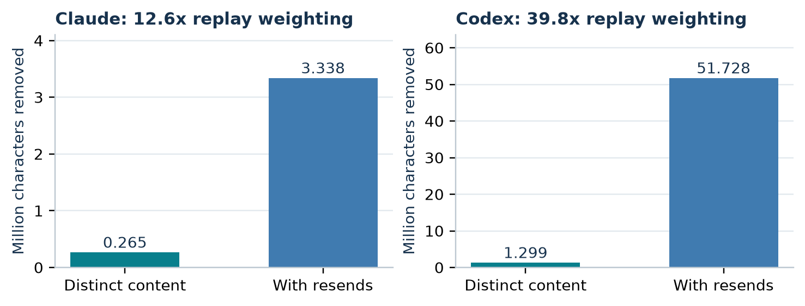
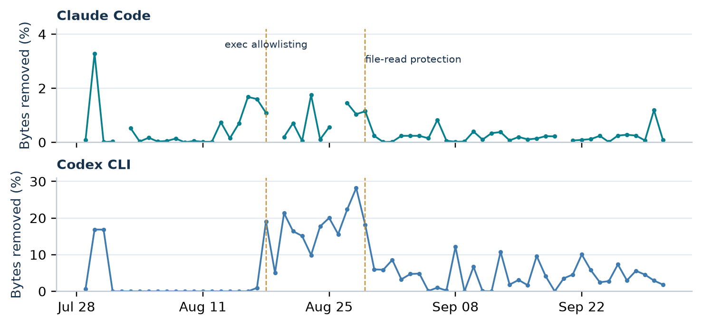
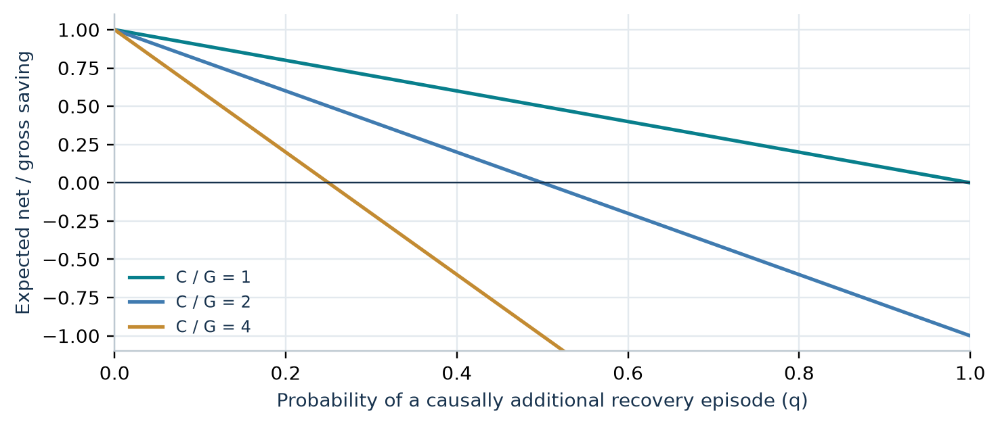

# Measuring TokenSaver Compression Savings

Byte-level guarantees, cache-aware economics, and observed agent behavior

RESEARCH DRAFT 0.2  |  5 OCTOBER 2026  |  Prepared for Robert Stokes

### Abstract

TokenSaver rewrites selected tool-result strings before coding-agent requests reach a model provider. This paper examines whether those rewrites constitute useful savings. It combines a 65-day dossier, additional archived studies, a current source audit, nine figures, and formal accounting and correctness arguments. The first October 1 meter snapshot reports reductions of **3.45% of request-body bytes for Codex CLI**, **0.20% for Claude Code**, and **0.18% for Grok CLI**. These are measurements of transmitted request bodies, not net billing-token effects. [1]

Repeated history explains why wire removal exceeds distinct-content removal by 12.60x and 39.81x in two historical samples. The corrected follow-up audit finds a related call in the next assistant turn after 19/35 Claude truncations and 146/448 classified Codex truncations. These associations do not establish that truncation caused extra turns. A source-level proof establishes byte non-growth for accepted replacements, and 475 focused tests passed on October 5. A second proof characterizes exactly when a compressed observation can preserve a task answer; arbitrary truncation cannot satisfy that condition for every task.

The evidence establishes gross transport reduction and specific engineering guarantees. It does not yet establish net billed-token savings or noninferior task success. We derive the break-even conditions and specify a paired experiment that can test both, without converting character counts or heuristic follow-ups into unsupported token claims.

| Claim | Evidence status |
| --- | --- |
| Smaller transmitted request bodies | Measured; provider and snapshot specific |
| Accepted rewrite cannot enlarge the body | Proved under the splice model; source checked |
| Stable rewriting and protocol behavior | Supported by focused regression tests |
| Lower total task cost with equal quality | Open empirical question; protocol specified |

Revision 0.2 adds a bounded September audit of 8,286 successful requests, a historical C# replay of 8,177 output variants under four configurations, actual usage buckets, and the file-read mitigation study. Historical replay evidence is kept separate from the 475 tests run for this draft.

## 1. System and study design

TokenSaver is a local proxy with provider-specific JSON rewriters. It correlates tool calls with their results, selects eligible text, runs deterministic cleanup, recognized-command reshaping and condensation stages, and accepts a replacement only if its serialized byte representation is smaller. The studied design passes provider responses through unchanged. System instructions, user messages and tool-call inputs are outside the selected tool-result spans. [1, 3]

| Mechanism | Current implementation boundary |
| --- | --- |
| Eligibility | Allowlisted shell results; dedicated Read/Grep scopes default off. Shell results can still contain source files. |
| Cleanup | Configured line-ending, trailing-space and blank-line normalization; not universal semantic equivalence. |
| Run collapse | At least three identical consecutive lines; replace only when the marker is smaller. |
| Truncation | Normally retain 150 head and 50 tail lines plus an elision marker. |
| File-read mitigation | Recognized file reads use 1,200 head and 200 tail lines if the post-dedupe text has at most 262,144 UTF-16 code units. |
| Activation threshold | Omitted middle must contain at least 10 lines and 4,096 UTF-16 code units. This is not a token or byte cap. |

### Populations and time windows

The dossier covers one developer's workstation from July 29 through October 1, 2026. Its derived sequence dataset contains 65,582 requests and 4,015 conversation keys; a separate historical corpus contains 49,851 content-hash-distinct tool outputs. These populations are not interchangeable. Conversation keys are derived from opening messages, and the sequence extractor retains the request with the most tool calls per conversation. Branches and segments after compaction can be missed. [1, sections 3-5]

The primary meter table uses activity from September 4 through the first October 1 snapshot. The daily figure uses a later October 1 reread. The follow-up classifier uses conversations first observed on or after August 30. Study A's distinct-content comparison uses August 28 for Claude and August 28-29 for Codex. Each figure states its own denominator and window.

Current source audit: vibe-rails 336373c0c51b2dc68abb3350910cee533502651a. Historical research checkout: vibe-books cf3253b99e6992e7b62564bfc3fb23f276a0e39c. File hashes accompany the draft. No raw request bodies were copied into the paper.

## 2. Accounting and a transport guarantee

Let $B_j$ and $A_j$ denote the UTF-8 byte lengths of the original and actually forwarded request body j. The gross transport reduction is the sum of accepted body differences. The byte-weighted share uses the sum of original bytes as its denominator; an unweighted mean of daily percentages estimates a different quantity.

$$
D_B=\sum_{j=1}^{J}(B_j-A_j),\qquad S_B=\frac{D_B}{\sum_{j=1}^{J}B_j}\tag{1}
$$

For a fixed provider model m, let $\tau_m(x)$ be its input-token counting function. A paired request-level token difference requires counting both complete original and transformed requests with that same model. A byte reduction does not imply a token reduction: tokenization is not monotone in string byte length, and model-specific framing also matters. The TokenSaver savings field instead uses floor(BytesSaved / 4), an explicit estimate. [4, 7]

$$
D_T=\sum_{j=1}^{J}\left[\tau_m(B_j^{\rm body})-\tau_m(A_j^{\rm body})\right]\tag{2}
$$

### Proposition 1. Accepted splices cannot enlarge the body

Assume the parser identifies disjoint eligible JSON string spans $s_i$ and untouched intervening spans $v_i$. Let $c_i$ be an encoded candidate replacement, and let $a_i$ equal $c_i$ only when its UTF-8 byte length is strictly smaller than that of $s_i$; otherwise $a_i$ equals $s_i$. The rewrite copies each $v_i$ without modification. Then:

$$
|R(B)|=\sum_i|v_i|+\sum_i|a_i|\ \leq\ \sum_i|v_i|+\sum_i|s_i|=|B|\tag{3}
$$

**Proof.** Every accepted span satisfies |$a_i$| < |$s_i$|, every rejected span satisfies equality, and disjoint concatenated byte lengths add. At least one accepted replacement makes the total inequality strict. All bytes outside accepted spans retain their original values. The three provider rewriters enforce the encoded-length comparison at the source locations listed in reference 3.

This is a guarantee about the implemented splice contract, conditional on correct parsing and copying. It does not prove that every tool-result meaning is preserved, that tokenization shrinks, or that a complete task requires fewer requests. Candidate stage traces can include rejected rewrites; actual savings must be conditioned on RewriteAccepted or derived from the forwarded body.

## 3. Distinct content, replay, and cache weighting

For distinct removed result content i, let $d_i$ be the removed character count and $m_i$ its number of appearances in subsequent requests. Under stable rewriting, $D_{\mathrm{unique}}$ = sum $d_i$ and $D_{\mathrm{wire,char}}$ = sum $m_i$ $d_i$. Their ratio is a removal-weighted mean replay count, not a task-saving multiplier. [1, section 6.3]

Figure 1. Historical Study A: character counts with and without replay weighting. Claude: August 28; Codex: August 28-29. Distinct content is content-hash deduplicated here. The two panels use different vertical scales.

Repeated input can be charged at a cache-read rate. For a block of d actual tokens, first-write multiplier w, read multiplier alpha, and m appearances, its gross avoided input cost is d[w + alpha(m - 1)] in units of the base input price. This identity assumes unchanged future requests, token counts, cache hits and cache boundaries. It is a conditional accounting model, not an observed net effect.

Figure 2. Illustrative accounting with w = 1.25 and fixed cache-read multipliers. At m = 40 and alpha = 0.10, the cost multiplier is 5.15, versus 40 raw token appearances. These curves are not fitted to study traffic.

Current provider documentation distinguishes cache-write and cache-read prices and includes model-specific exceptions. Rates must be pinned per model and date before calculating money. The study's historical provider-wide factors are not used here to claim current dollar savings. [6]

## 4. Measured request-body reduction

Figure 3. Reported gross request-body byte reduction in the first October 1 meter snapshot, activity since September 4. Denominators: Claude 16,238 requests; Codex 16,227; Grok 1,212. Sizes in the dossier are rounded; percentages are reproduced as reported. [1, section 6.1]

| Agent | Original body data | Removed | Share |
| --- | --- | --- | --- |
| Claude Code | 7.71 GB | 15.4 MB | 0.20% |
| Codex CLI | 9.93 GB | 343 MB | 3.45% |
| Grok CLI | 673 MB | 1.2 MB | 0.18% |

Figure 4. Daily reported byte-reduction percentages from the later October 1 meter reread. Missing Claude days remain gaps; October 1 is partial. Dashed lines mark reported rollout dates, not randomized interventions. Axis scales differ by panel. [1, Appendix A.1]

The later daily ledger gives approximately 0.19% for Claude and 3.39% for Codex when rounded daily byte totals are summed before division. Those later totals are not combined with the earlier Figure 3 counts. Provider mix, harness behavior and workload changed over time; the rollout annotations alone do not identify causal savings.

## 5. What agents do after truncation

The corrected audit assigns the strongest related-call tier found in the next assistant turn. T0 requires both an explicit acknowledgment of incomplete output and a related call; T1 requires an exact command repeat; T2 requires stronger path/range evidence; T3 retains a looser relation. T1 is zero in the plotted groups. These are classifier outputs, not observed extra-turn causes. [1, section 7.2; 2]

Figure 5. Next-turn related-call classification after truncation. Codex excludes 19 of 467 unresolved command wrappers. Diff/show/log and grep are subsets of the Codex classified group; they are not additional independent populations.

| Population | Strict T0-T2 | Including loose T3 |
| --- | --- | --- |
| Claude, all truncations | 19 / 35 = 54.29% | 26 / 35 = 74.29% |
| Codex, classified | 146 / 448 = 32.59% | 199 / 448 = 44.42% |
| Codex, diff/show/log | 122 / 284 = 42.96% | 156 / 284 = 54.93% |
| Codex, grep | 14 / 106 = 13.21% | 28 / 106 = 26.42% |

Treating all 19 unresolved Codex cases as negative or positive bounds the full-sample strict fraction between 146/467 = **31.26%** and 165/467 = **35.33%**. This is a sensitivity bound for missing classifications only. It does not cover classifier error, missed later recovery, missing conversation branches, or causality.

The audit also reports 318 thousand removed characters and 152 thousand follow-up-output characters for Claude; Codex reports 8,255 thousand and 1,860 thousand. These are decoded-character sums over marked result instances in retained timelines, before replay weighting. They are not guaranteed globally distinct content. The follow-up may contain different information, and may have occurred anyway. Subtracting these columns would not measure net savings.

No population confidence intervals are attached to these counts: result instances cluster within conversations, the workload comes from one developer, and the classifier itself is imperfect. Silence after truncation is not evidence that the omitted content was irrelevant.

## 6. The economics of recovery

Let G be the gross avoided input cost under a fixed baseline continuation, q the probability that compression causally adds a recovery episode, C the expected incremental cost conditional on such an episode, and K other incremental costs, including cache changes. All costs use the same currency or a fixed base-price unit. Under this explicitly simplified model:

$$
E[N]=G-qC-K,\qquad q^*=\frac{G-K}{C}\quad(C>0)\tag{4}
$$

Positive expected net savings require q < q*. A threshold below zero means recovery is not needed to erase the gross benefit; a threshold above one means the modeled gross benefit exceeds all possible recovery incidence at the assumed C. The formula is algebra, not an estimate of q or C. The audit's related-call frequency is not q.

Figure 6. Hypothetical break-even sensitivity: normalized net = 1 - q(C/G), with K = 0. Lines vary the assumed recovery cost. No observed follow-up rate is plotted on these curves; the causal probability and incremental cost have not been measured.

### A worked example, with assumptions exposed

Assume a removed block has 1,000 actual model tokens, appears 20 times, is first written at w = 1.25, and is read 19 times at alpha = 0.10. Gross avoided input cost is G = 1,000(1.25 + 19 x 0.10) = **3,150 base-price units**. If one causally additional recovery episode costs 10,000 of those units and K = 0, then q* = 0.315. At q = 0.10, expected net is +2,150; at q = 0.50 it is -1,850. These values are illustrative, not study measurements.

For actual bills, use the response usage categories and the price schedule effective at each call. Write total task cost as the sum over requests of $p_{\mathrm{uncached}}$ U + $p_{\mathrm{write}}$ W + $p_{\mathrm{read}}$ R + $p_{\mathrm{output}}$ O, plus any other billed fees. Model versions, caching tiers, long-context rules and subscription accounting must be recorded. A byte/4 meter cannot supply those terms.

## 7. What correctness can mean

### Proposition 2. Exact task preservation has a necessary and sufficient condition

Let x be a full tool observation, C(x) its compressed form, and g(x) the correct answer to a specified task. There exists a decoder h that recovers the answer from the compressed form exactly when g is constant on each set of inputs that C maps to the same output:

$$
\exists h:\ h(C(x))=g(x)\ \forall x\quad\Longleftrightarrow\quad C(x)=C(y)\Rightarrow g(x)=g(y)\tag{5}
$$

**Proof.** Necessity: if C(x) = C(y), the decoder receives the same input, so h must return the same answer. Sufficiency: for each compressed output z, define h(z) to be the common g-value of any input mapped to z. Constancy makes this definition unambiguous.

**Counterexample for unrestricted truncation.** Choose two long outputs with identical retained head and tail, equal omitted line counts, and different omitted middle facts. A question about those facts has different correct answers, yet the compressed strings and markers can be identical. Therefore arbitrary lossy truncation cannot preserve every possible task. Even when an answer is preserved, a particular LLM may fail to extract it. A task-outcome comparison remains necessary.

### Implementation evidence collected for this draft

**475 tests passed, 0 failed, 0 skipped** in a focused run of ten existing TokenSaver test classes on October 5, 2026, using .NET SDK 10.0.401. The selection covered cleanup, condensation, golden fixtures, command shaping, file-read budgets, line endings, and all three provider rewriters. The shared tree contained unrelated edits; no TokenSaver or Tests/TokenSaver edits were present before the run. The exact selection is in validation.json. [5]

| Property | Evidence and scope |
| --- | --- |
| Byte non-growth and untouched spans | Encoded-length gates in three rewriters; provider regression tests. |
| Determinism and idempotence | Fixed configuration; cleanup flag combinations, condenser combinations and pipeline composition fixtures. |
| Protocol preservation | Provider-specific parsing/rewriting fixtures and original-byte fallback. |
| Downstream task quality | Not established by these tests or by the historical trace audit. |

Idempotence of individual stages does not imply idempotence of their composition. The suite explicitly includes composition cases. Historical research also reports a 108-combination sweep and zero compression-attributed divergences in 64 investigated close-in-time cache misses; those are bounded samples, not universal guarantees. [1, sections 5.6 and 8.2]

## 8. A bounded September request audit

The expanded archive search found a September 8 mining report and its saved aggregates outside the main dossier, in an ignored experiment directory. Its extraction fixed the lower date at September 4 and the upper source row at 61,143, ending at 17:33:05 UTC on September 8. It retained 8,286 HTTP-200 model requests and 10 unsuccessful requests; model-list and count-token endpoints were excluded. The table and figure below use successful requests only. [9]

Figure 7. A separate bounded population: observed original-minus-forwarded UTF-8 request-body bytes. These exact saved aggregate counts produce the plotted rates. The interval overlaps Figure 3; do not pool the two populations or treat this as an independent controlled replication.

| Agent / requests | Original bytes | Removed bytes | Rate |
| --- | --- | --- | --- |
| Claude Code / 6,209 | 1,698,925,099 | 3,889,891 | 0.229% |
| Codex CLI / 1,843 | 1,532,592,995 | 21,603,929 | 1.410% |
| Grok CLI / 234 | 195,745,155 | 252,138 | 0.129% |

### Production-source replay on recorded outputs

The saved study replayed **8,177 distinct provider/tool/command/raw/after variants** through C# pipeline source from commit 2d4ee182. Four configurations covered defaults, ordinary cleanup, cleanup plus ANSI removal, and defaults plus ANSI removal: **32,708 variant/configuration cases**. The saved flags show zero character-growth, canonical-JSON-byte-growth, nondeterminism or idempotence failures, and the completed run reports no exceptions. This is historical corpus evidence, not a replay performed for this revision. [9]

Inputs were recorded **after-texts**, with command metadata; character growth uses UTF-16 code units. Some replayed tool types were outside the live allowlist. The helper exercises the pipeline, not the complete HTTP adapter; canonical JSON is not each producer's escaping. Including after-text in the key preserves 28 raw-output groups with multiple transformed versions, which the older corpus could overwrite. This does not establish task success.

## 9. File-read preservation and stage interactions

An earlier investigation discovered that shell-based file reads were being truncated despite dedicated file-read tools being out of scope. The ensuing mitigation widened the line budget for detected file reads. Offline replay of the production predicate over 261 previously elided outputs detected 205 for protection (78.54%); those outputs accounted for 2,960,996 of 4,056,231 characters removed before the fix (73.00%). [10]

Figure 8. Historical detector replay, captured traffic August 26-29. The left panel counts outputs; the right associates their historical removal with the detector decision. This is mitigation coverage, not newly saved tokens or a task-quality effect. The panels use different units.

The August 30 rerun reproduced 205/261 on the same sample. An expanded 288-output sample detected 217 (75.35%), associated with 3,153,691 characters of historical removal; the reported size ceiling excluded none of these 217. These are different denominators, so the percentage change is not evidence of a detector regression. The source notes that no live soak had yet been completed. [10]

### Why an apparently safe stage needs a complete-pipeline check

The September 4 review found that an ANSI-removal Python mirror used outdated blank-line and file-read rules. After correction, its opportunity estimate was about 22.69 million replay-weighted characters: 9.63 million from ANSI plus ordinary cleanup and 13.06 million from newly enabled lossy condensation. Those are candidate replay estimates, not measured wire savings. A stage that removes control codes can enable downstream truncation; the entire resulting change cannot be credited to harmless formatting cleanup. [11]

The bounded September 8 production replay found only 4,830 additional replay-weighted UTF-16 code units from Codex ANSI cleanup over ordinary cleanup, across six outputs. A dedicated Read cleanup candidate offered 28,391 weighted code units for Claude. These are candidate opportunities in a different window, not comparable realized savings. They support testing each proposed expansion against the actual pipeline. [9]

## 10. Actual token usage is available, with limits

The September 8 extraction preserved provider-reported usage for every successful Claude request. This supplies a firmer accounting basis than characters divided by four. The following values cover the 6,209 Claude requests in Figure 7, including main and side requests. The categories describe actual usage under the observed system; there is no matching uncompressed token counterfactual. [9]

Figure 9. Actual provider-reported usage in the bounded September audit. Left: disjoint input categories; right: the cache-write category split by duration. Panels use different scales. Output tokens are reported separately in the table and are not included in the input bars.

| Reported category | Tokens |
| --- | --- |
| Uncached input | 408,496 |
| 5-minute cache writes | 9,985,648 |
| 1-hour cache writes | 8,733,135 |
| Cache reads | 539,740,748 |
| Total input | 558,868,027 |
| Output | 3,694,448 |

Duration buckets matter when pricing writes. A historical classifier-request family in the same study reported 4,634,900 cache-write tokens, all in the one-hour bucket. A blanket first-write factor of 1.25 cannot describe that family under a schedule that charges one-hour writes at a different rate. The illustrative equations in this paper keep rates explicit; a realized bill comparison must also retain each model's price and effective date. [6, 9]

The archive reports usage missing from 100 successful Codex responses and 9 successful Grok responses in this bounded sample. Usage composition for those consumers is therefore incomplete. Across all providers, exact observed usage alone still cannot attribute the difference caused by compression: the paired task experiment must supply that missing comparison.

## 11. Source reconciliation and uncertainty

Several source phrases require stricter definitions before use in a paper. The draft preserves the historical findings while correcting the following interpretations. These corrections are measurement clarifications; no product changes or raw-data re-extraction were performed.

| Source phrase or shortcut | Treatment in this paper |
| --- | --- |
| "Tokens saved" from BytesSaved / 4 | Estimated tokens only. Actual model token counts and billable usage are separate. |
| Audit KB / MB values | Thousands / millions of decoded characters where the scripts use Python len(text). Meter bytes remain UTF-8 bytes. |
| "Unique" tiered-audit removal | Marked result instances from one retained timeline per conversation; no global content-hash deduplication. |
| 11.2 MB = 0.23% of 6,154 MB | Not a valid equality: the script uses tool-result character delta for the size, but serialized-request character delta for the percentage. Omitted from the figures. |
| Single October 1 total | Initial meter and later daily reread are distinct snapshots. |
| "Refetch cost" | A related next-turn call is observed; causally additional work and recovered content are unknown. |
| "Lossless" cleanup | Normalization under restricted text assumptions; not byte reversibility or all-language semantic preservation. |

### Threats to validity

**Selection and dependence.** One developer and workstation supply the traffic. Provider, task, model and harness differences are entangled. Requests and results are correlated within tasks. The authors of the original analysis were themselves coding agents whose traffic entered the dataset. The observation period was not randomized.

**Incomplete trajectories and capture.** Conversation hashing and maximum-tool-count selection can omit branches and post-compaction segments. Command summaries stop at 400 characters; follow-up detection examines only the next turn. A separate backup audit documents possible capture loss, body-size limits and no durable inventory of capture gaps. Recorded traffic is not guaranteed to include every request. [12]

**Unknown counterfactuals.** The logs do not reveal the uncompressed task trajectory, recovered information, incremental recovery cost or eventual task quality. Historical cost models used a loose classifier and a subsequently corrected output-price factor. Their net estimates are not reproduced as results here.

**Freshness.** Current source checks and passing tests do not remeasure July-October workloads under today's configuration. No evidence here supports universal, product-wide or future-model savings rates.

## 12. An experiment that can establish net savings

Compare complete tasks under a fixed harness, frozen repository, explicit acceptance criteria and prespecified analysis. The primary questions are whether compression reduces total task cost and preserves task success within an agreed noninferiority margin. Output replay alone cannot reveal changes in agent behavior.

| Design element | Prespecified requirement |
| --- | --- |
| Arms | A: proxy pass-through; B: cleanup/shape without lossy condensation; C: current full pipeline. Optionally add a diff-preserving arm as a separate contrast. |
| Pairing and allocation | Run the same tasks from identical repository snapshots; randomize arm order and repeat stochastic runs. Pin provider/model, CLI, settings, tools and context budget. |
| Cache control | Define cold or standardized warm starts; isolate cache namespaces where supported; counterbalance order and log actual cache usage. |
| Primary cost | All request and response usage through task completion or a fixed stop rule, including recovery, summaries, retries and review work included in scope. |
| Primary quality | Blinded assessment against task acceptance criteria plus relevant checks. Include incomplete runs and failures in the assigned arm. |
| Secondary outcomes | Wall time, tool calls, follow-up episodes, exact per-stage token/byte changes and preservation of critical evidence. |

For a task set with costs $C_{k,A}$ and $C_{k,C}$, report the ratio of total costs, not the mean of task-level percentage reductions:

$$
\widehat{S}_{\rm cost}=1-\frac{\sum_{k=1}^{n}C_{k,C}}{\sum_{k=1}^{n}C_{k,A}}\tag{6}
$$

Resample tasks with all paired arm runs together; stratify by provider and task family. Requests within tasks are dependent. A pilot must estimate task-level variance and disagreement rates before setting the final sample size.

Let Q be task-success probability. Prespecify an acceptable margin delta and require the lower confidence bound for $Q_C$ - $Q_A$ to exceed -delta. Require both a positive lower bound on cost savings and this quality criterion before claiming reliable net savings without material quality loss. Report all assigned tasks; selecting successful runs alone can hide compression-induced failures.

This is a proposed protocol. No randomized outcome experiment, new database logging, or paid model benchmark was initiated for this draft.

## 13. Interpretation and reproducibility

The evidence supports a precise claim: **TokenSaver reduced transmitted request-body bytes in the observed workload, with different rates by provider.** Accepted encoded replacements cannot enlarge the rewritten request under the splice contract, and the focused regression suite passes.

Net token economics remain unresolved. Claude's gross reduction is small in this window, while related follow-ups are common among its truncated results. Codex removes more data but shows a substantial diff-related follow-up signal. These patterns motivate further comparisons; they do not establish a monetary gain or loss caused by compression.

Public claims should retain dates, workload and denominators. Bytes/4 are estimated tokens, not billed usage; absent follow-ups do not prove correctness. The preservation theorem explains why quality evidence must be tied to specific tasks.

### Reproduction package

| File | Purpose |
| --- | --- |
| tokensaver-research-draft.tex | Standalone editable paper source; inline vector figure definitions and equations. |
| output/pdf/tokensaver-research-draft.pdf | Typeset reading copy generated from the same manuscript blocks. |
| evidence.json / daily-series.csv | Published aggregates, daily rows, computed ratios and explicit units. |
| source-manifest.json | SHA-256 hashes of source files, repository revisions and source locations. |
| validation.json | Exact focused test command, result, environment and calculation assertions. |
| build_paper.py / figures/ | Offline paper builder; publication figures in PDF, SVG and PNG. |
| output/docx/tokensaver-research-editable.docx | Word review copy with native equations and tracked future edits. |
| tokensaver-research-review.md / REVIEW.md | Agent-editable manuscript, stable claim IDs and return instructions. |

The builder parses the dossier's daily table and September 8 aggregates, recomputes ratios and produces nine figures. research-discovery.txt records the expanded search. No application database was queried; raw captured text is excluded. LaTeX embeds its plot data, while the PDF uses the same manuscript blocks and measurements.

Rebuild: run Python on build_paper.py; plotting dependencies are in .deps. Internal source paths are local provenance pointers. External publication needs a redacted, immutable aggregate archive and independently runnable benchmark.

## References and provenance

**[1]** VibeRails research archive. Does lossy tool-output compression save tokens, or just move them? A measurement dossier from 65 days of proxied coding-agent traffic. October 1, 2026. token_saver/research_2026-10-01.md; sections 3-9 and Appendix A.

**[2]** VibeRails research archive. Tiered follow-up analysis and extraction code. python-scripts/token_saver/tiered_rerun_audit.py (counts and character sums), scan_conversations.py (string lengths and retained timelines), timeline_stats.py (composition and daily grouping). Saved corrected aggregate: results/vibe6-paper/tiered_rerun_2026-08-30_20261001_201359.md.

**[3]** VibeRails source. TokenSaver/Minify/AnthropicMessagesRewriter.cs:188, 201, 229; CodexResponsesRewriter.cs:209; ChatCompletionsRewriter.cs:176. Encoded replacement gates, accepted traces and fallback copying. TokenSaver/Minify/OutputCondenser.cs:55, 82, 165, 263, 351. Budgets, line collapse and truncation.

**[4]** VibeRails source. VibeRails.Data.Abstractions/DB/ITokenSavingsStore.cs:9-26. Per-request byte accounting and integer BytesSaved / 4 estimate. TokenSaver/Pipeline/CompressionCatalog.cs:201. Default scopes.

**[5]** VibeRails tests. Tests/TokenSaver/OutputMinifierTests.cs:487; OutputCondenserTests.cs:319; PipelineGoldenFixtureTests.cs:107; ShapeFilterTests.cs:877; file-read, CRLF and provider-rewriter test classes. Focused run October 5, 2026: 475 passed, no failures or skips. Full filter in validation.json.

**[6]** Anthropic. Prompt caching. Official developer documentation; accessed October 5, 2026. Used for exact-prefix requirements and distinct cache write/read prices, with model exceptions.

https://platform.claude.com/docs/en/build-with-claude/prompt-caching

**[7]** Anthropic. Token counting. Official developer documentation; accessed October 5, 2026. Counts depend on the selected model and may differ slightly from actual message usage.

https://platform.claude.com/docs/en/build-with-claude/token-counting

**[8]** VibeRails research archive. Token saver effectiveness review, October 1, 2026, with October 2 follow-up. token_saver/review_2026-10-01.md. Historical interpretation and implementation handoff; the more cautious consolidated dossier governs empirical claims in this draft.

## References and provenance (continued)

**[9]** VibeRails research archive. TokenSaver mining, September 8, 2026. python-scripts/token_saver/results/codex-mine-0908/findings.md and summary.json; saved replay-output.jsonl numeric flags. Production-source diagnostic: python-scripts/token_saver/replay_pipeline/Program.cs. Bounded request counts, replay invariants, usage buckets and candidate comparisons.

**[10]** VibeRails research archive. truncate-long was cutting holes in source files: findings and fix. token_saver/truncation_file_reads.md, sections 4-6. August 29-30, 2026. Production-predicate replay and sample-specific protection coverage.

**[11]** VibeRails research archive. V1 TokenSaver findings: review of Claude's Codex analysis. token_saver/v1_findings_claude_codex_response.md, September 4, 2026, sections 2-7. Corrected cost assumptions and ANSI-mirror estimates. Candidate estimates are not treated as realized wire savings.

**[12]** VibeRails research archive. Backup coverage audit, September 14, 2026. vibe-data/docs/backup-coverage-audit.md, proxy-database and capture-limit sections. Archival Brotli ratios concern storage and are excluded from TokenSaver efficacy claims.

### Source fingerprint

Consolidated dossier SHA-256: 94c99e4fd879a801411bff602bf754df18c59db9032a21e76741e62acdf0d11d

The complete file-level source manifest accompanies the paper. Source line references identify the checked local revision and may move in later versions. Internal research sources are not peer-reviewed publications. Historical aggregates were reused and recalculated; the October 5 source inspection, mathematical derivations, plots and focused test run are new work for this draft.
