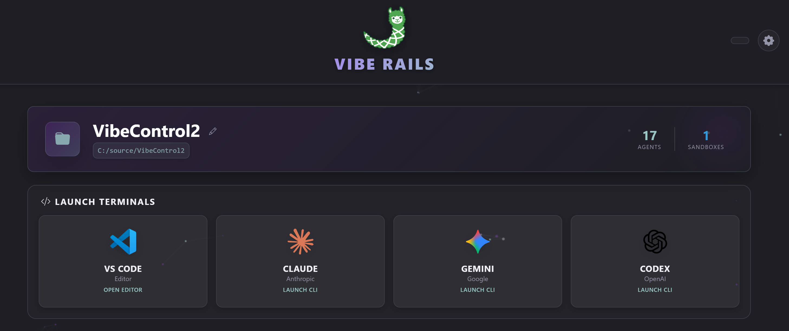
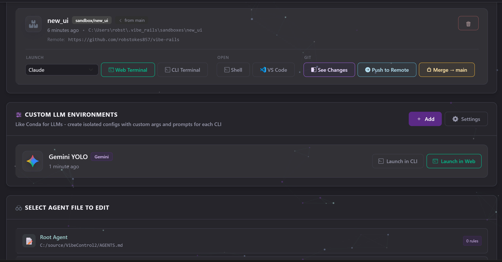

# VibeRails for VS Code

**An opinionated framework that helps keep AI coding assistants from going off the rails.**

---

## Overview

VibeRails brings the full dashboard directly into VS Code. The extension automatically manages the backend server — just click and go. No manual setup, no terminal juggling, no configuration files to write.

Works with **Claude CLI**, **OpenAI Codex**, and **Google Gemini CLI**.

## Features

- **Environment Isolation** — Like Conda for LLMs. Create separate environments to experiment with different CLI settings without breaking your primary setup
- **Cross-LLM Learning** — Share context and learnings between Claude, Codex, and Gemini
- **RAG Without the Rot** — Track repeated fixes, file change summaries, and how you describe features. Only provide what's useful at call time to prevent context rot
- **Few-Shot Prompting** — Get Gemini or Codex to code like Claude for patterns that have been done before
- **Rule Enforcement** — Define and enforce coding standards like test coverage, cyclomatic complexity, logging practices, and more. LLMs fix their errors before code can be pushed
- **Token Savings** — Smart file hints reduce token usage and costs by learning your codebase
- **AGENTS.md Management** — Create and manage agent instruction files following the [agents.md specification](https://agents.md/)
- **Web Terminal** — Launch CLIs in a browser-based terminal (xterm.js) with full PTY support, Unicode, and color output

## Preview

### Dashboard

### Environments

### Web UI Terminal

## Getting Started

1. **Install** the extension from the VS Code Marketplace
2. **Click** the rocket icon in the status bar or run `VibeRails: Open Dashboard` from the command palette
3. **Done** — the backend installs automatically on first run

You'll need at least one LLM CLI installed: [Claude](https://docs.anthropic.com/en/docs/claude-cli), [Codex](https://github.com/openai/codex), or [Gemini](https://github.com/google-gemini/gemini-cli).

## Commands

| Command | Description |
|---------|-------------|
| `VibeRails: Open Dashboard` | Open the VibeRails dashboard in a webview panel |
| `VibeRails: Stop Dashboard` | Stop the dashboard and terminate the backend |

## Settings

| Setting | Default | Description |
|---------|---------|-------------|
| `viberails.executablePath` | *(auto-detect)* | Path to the VibeRails executable. If empty, the extension searches common locations |
| `viberails.devWwwroot` | *(empty)* | Override path to wwwroot for development. Takes priority over bundled assets |

## Supported Platforms

| Platform | Architecture |
|----------|-------------|
| Windows | x64 |
| Linux | x64 |
| macOS | x64, ARM (Apple Silicon) |

## Links

- **Website**: [viberails.ai](https://viberails.ai/)
- **GitHub**: [robstokes857/vibe-rails](https://github.com/robstokes857/vibe-rails)
- **Issues**: [Report a bug](https://github.com/robstokes857/vibe-rails/issues)

## License

[MIT](LICENSE)

Copyright (c) 2026 Robert Stokes
