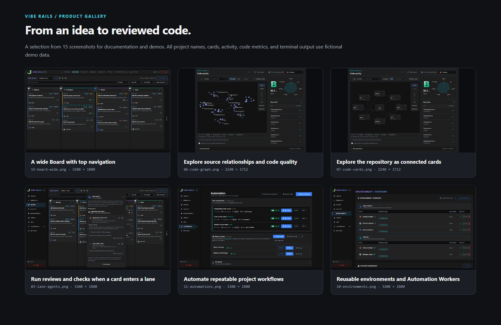

# VibeRails screenshots

Fifteen PNG screenshots for repository docs, the VS Code listing, presentations, and demos. All captures use the actual VibeRails frontend with fictional **Trailhead** data. Quality scores, agent activity, and terminal output are illustrative.

Open `index.html` locally for a clickable gallery, or select an image below.

| Image | Suggested use |
| --- | --- |
| [01 — Board](01-board.png) | Overview with sidebar navigation |
| [02 — Board close-up](02-board-closeup.png) | Work lanes and active agents |
| [03 — Lane agents](03-lane-agents.png) | Reviews and checks on lane entry |
| [04 — Card details](04-card-details.png) | Requirements, Markdown, and assignment |
| [05 — Project health](05-project-health.png) | Rules, Git Guard, and quality overview |
| [06 — Code graph](06-code-graph.png) | Source relationships and quality report |
| [07 — Code cards](07-code-cards.png) | Connected module overview |
| [08 — Code inspector](08-code-inspector.png) | File selection and relationships |
| [09 — Quality details](09-quality-details.png) | Saved measurements and code excerpt |
| [10 — Environments](10-environments.png) | Coding profiles and Workers |
| [11 — Automations](11-automations.png) | Scheduled workflows and Python scripts |
| [12 — Card discussion](12-card-discussion.png) | Agent handoff and review discussion |
| [13 — Environment settings](13-environment-settings.png) | Prompt and workspace configuration |
| [14 — Terminal](14-terminal.png) | Terminal interface with a sample transcript |
| [15 — Wide Board](15-board-wide.png) | README hero or opening demo slide |

## Capture notes

- Fresh browser context; every network request intercepted or blocked.
- No application backend, database, account, private card, or real terminal history loaded.
- No personal desktop, browser chrome, login links, or real credentials captured.
- These are shared dashboard UI captures. VS Code editor chrome is outside the images.
- PNGs are direct browser captures. No generated UI, blurred data, or image retouching.

The [capture manifest](capture-manifest.json) records dimensions, hashes, and fixture validation results. See the [capture instructions](../../../UITests/marketing/README.md) to regenerate the set.
